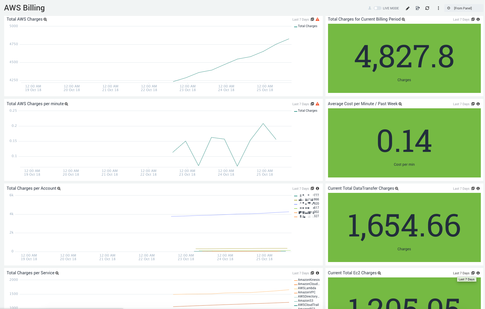

# Sumo Logic for AWS Billing Cloudwatch Metrics
Sumo Logic Community Content built for AWS Billing CW Metrics not yet published to the [App Catalog](https://help.sumologic.com/docs/integrations/).

This dashboard provides high level insights into your AWS billing. Alerts can be generated from these metrics in Sumo Logic.

### To use the content:
- Download the JSON file(s).
- Find/replace all Source Categories within the JSON with your own Source Category (Ex: sourceCategory=yourSourceCategory).
- [Import](https://help.sumologic.com/docs/get-started/library/#import-content) the content to your desired folder location in Sumo Logic.

### Collection
For instructions on how to collect logs and metrics for use with content, please see [Sumo Logic Documentation](https://help.sumologic.com/docs/send-data/). See [Amazon CloudWatch Source for Metrics](https://help.sumologic.com/docs/send-data/hosted-collectors/amazon-aws/amazon-cloudwatch-source-metrics/) or [AWS Kinesis Firehose for Metrics Source](https://help.sumologic.com/docs/send-data/hosted-collectors/amazon-aws/aws-kinesis-firehose-metrics-source/).

### To upload your own content:
Please see [Sumo Logic Community Ecosystem Apps FAQs](https://help.sumologic.com/docs/integrations/community-ecosystem-apps/#faq).

### To add a review to content:
Please follow [How to add a review/rating to an app](https://help.sumologic.com/docs/integrations/community-ecosystem-apps/#how-do-i-add-a-reviewrating-to-an-app)