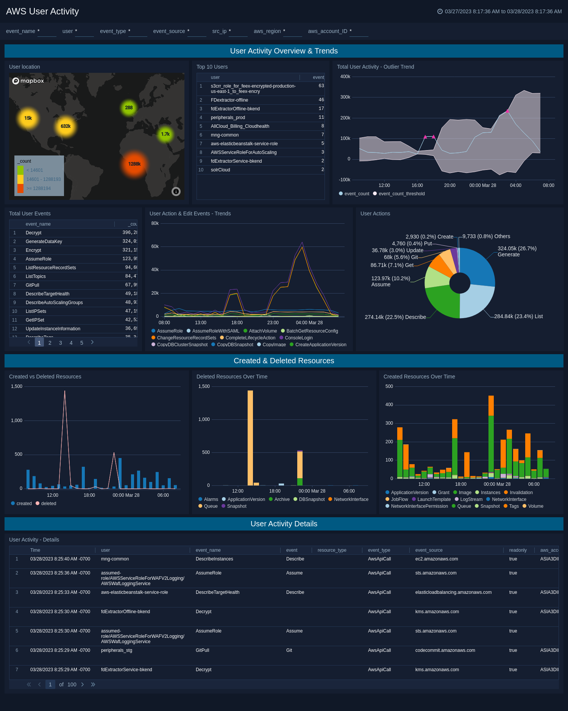

# Sumo Logic for AWS CloudTrail User Activity

Sumo Logic Community Content built for AWS CloudTrail User Activity that is not published to the [App Catalog](https://help.sumologic.com/docs/integrations/).

## To use the content

- Download the JSON file(s).
- Find/replace all Source Categories within the JSON with your own Source Category (Ex: sourceCategory=yourSourceCategory).
- [Import](https://help.sumologic.com/docs/get-started/library/#import-content) the content to your desired folder location in Sumo Logic.

### Collection

For instructions on how to collect CloudTrail logs and to use with content, please see [Sumo Logic Documentation](https://help.sumologic.com/docs/integrations/amazon-aws/cloudtrail/).

### Content Details

This dashboard was built to monitor AWS user activity and actions using CloudTrail data. The panels contained in this dashboard use a combination of custom-built queries and queries that are already available via the App Catalog dashboards for CloudTrail logs. This dashboard was built to easily filter on a user or event and immediately view the relevant details and trends.

To make searching across these logs easier and more efficient, install Field Extraction Rules using the parsing logic contained in the "CloudTrail_FERS.txt" file in the "Dashboard & FERs" directory. For more details on how to create field extraction rules, please reference [Creating a Field Extraction Rule](https://help.sumologic.com/docs/manage/field-extractions/create-field-extraction-rule/).

### To upload your own content

Please see [Sumo Logic Community Ecosystem Apps FAQs](https://help.sumologic.com/docs/integrations/community-ecosystem-apps/#faq).

### To add review/comment to content

Please provide a review/comment for this content by following the guidelines below:

- Select the **Comments** folder.
- Open the **Comments.json** file.
- Select Edit (pen icon).
- Add a new line below the current comments, and paste in your review/comment using the following schema:

        {
            "reviewer":"[githubid/name]",
            "ratings":{
                "overall":4,
                "use-case":5,
                "design":4,
                "technical":4
            },
            "review":"This app is very useful for knowing x, y, and z. It would be great if the dashboards were broken out by use case instead of being one big dashboard."
        }

- Select **Propose New Changes**.
- Submit **Pull Request**.

Code owners will review and merge your comments on the content to the repo.

Please see [How to add a review/comment to an app](https://help.sumologic.com/docs/integrations/community-ecosystem-apps/#how-do-i-add-a-reviewrating-to-an-app) for more information.
