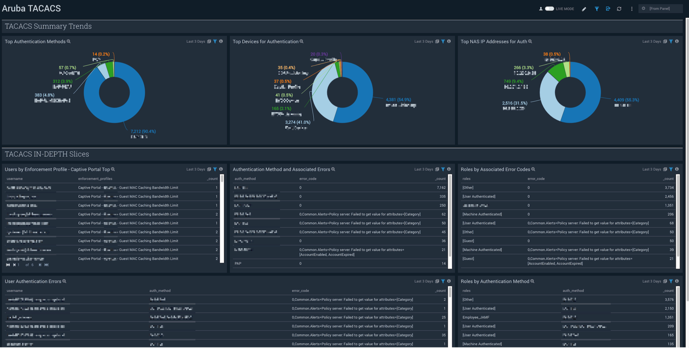

# Aruba Wireless TACACS
To use the content:
- Download the JSON file(s).
- Find/replace all Source Categories within the JSON with your own Source Category (Ex: sourceCategory=yourSourceCategory).
- Import the content to your desired folder location in Sumo Logic.

