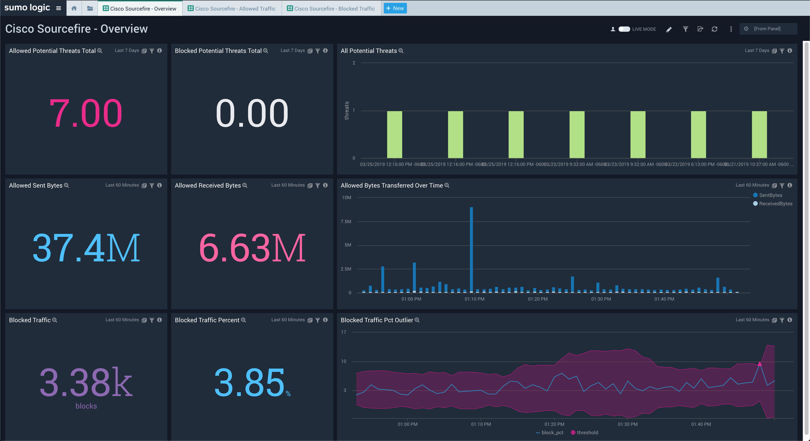
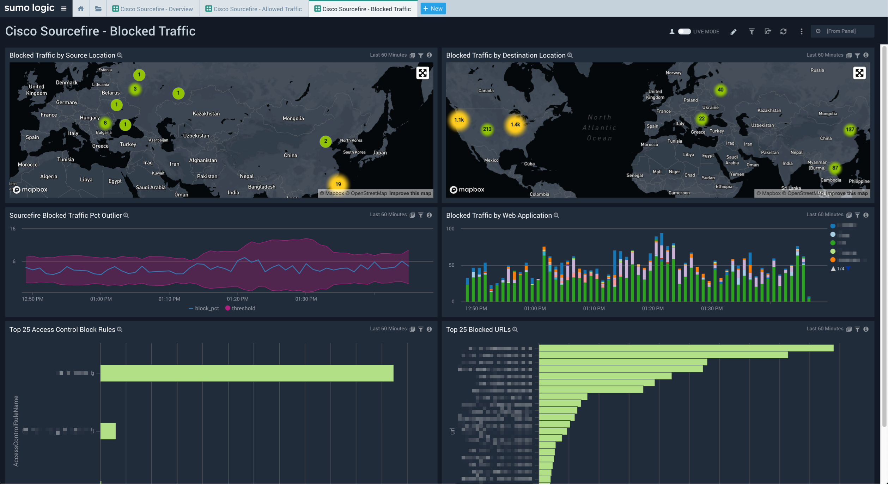
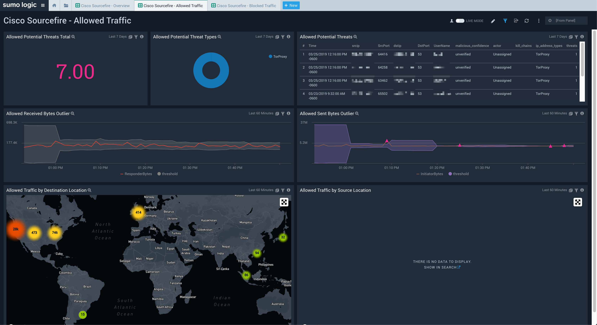

# Sumo Logic for Cisco Sourcefire
Sumo Logic Community Content built for Cisco Sourcefire not yet published to the [App Catalog](https://help.sumologic.com/docs/integrations/).

This Sumo Logic app is a collection of 3 dashboards that utilizes Sourcefire logs. It gives insights into allowed and blocked traffic. Portions of the app relies on a scheduled view for the integrated Threat Intelligence.

### To use the content:
- Download the JSON file(s).
- Find/replace all Source Categories within the JSON with your own Source Category (Ex: sourceCategory=yourSourceCategory).
- [Import](https://help.sumologic.com/docs/get-started/library/#import-content) the content to your desired folder location in Sumo Logic.

### Collection:
For instructions on how to collect logs and metrics for use with content, please see [Sumo Logic Documentation](https://help.sumologic.com/docs/send-data/). For the log portion of the app, you will need to configure your device to send the logs to a Sumo Logic [syslog source](https://help.sumologic.com/03Send-Data/Sources/01Sources-for-Installed-Collectors/Syslog-Source). Setup a Scheduled View for the `threat_intel_ip_address` view found in the [Threat Intel Optimized app](https://github.com/SumoLogic/sumologic-content/blob/master/Sumo-Logic-Tools/Threat_Intelligence_Optimized/scheduled-views.txt).

### To upload your own content:
Please see [Sumo Logic Community Ecosystem Apps FAQs](https://help.sumologic.com/docs/integrations/community-ecosystem-apps/#faq).

### To add review/comment to content:
Please provide a review/comment for this content by following the guidelines below:

- Select the **Comments** folder.
- Open the **Comments.json** file.
- Select Edit (pen icon).
- Add a new line below the current comments, and paste in your review/comment using the following schema:

        {
            "reviewer":"[githubid/name]",
            "ratings":{
                "overall":4,
                "use-case":5,
                "design":4,
                "technical":4
            },
            "review":"This app is very useful for knowing x, y, and z. It would be great if the dashboards were broken out by use case instead of being one big dashboard."
        }

- Select **Propose New Changes**.
- Submit **Pull Request**.

Code owners will review and merge your comments on the content to the repo.

Please see [How to add a review/comment to an app](https://help.sumologic.com/docs/integrations/community-ecosystem-apps/#how-do-i-add-a-reviewrating-to-an-app) for more information.