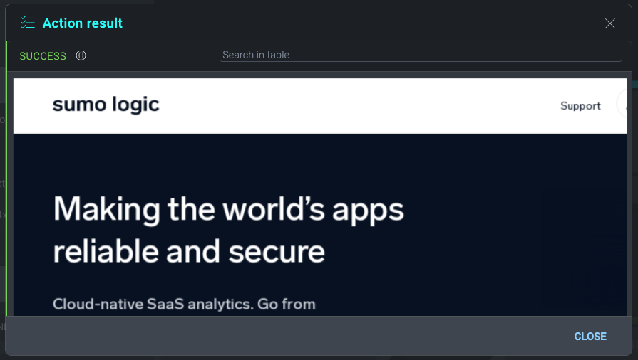
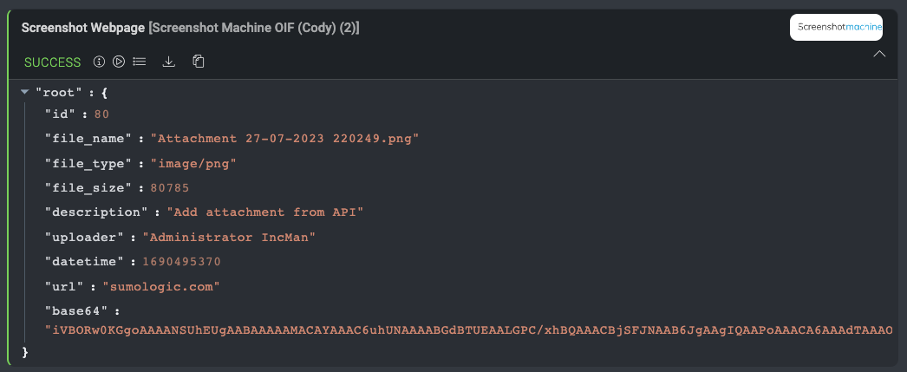

# Screenshot Machine
Sumo Logic Custom CloudSOAR Integration for Screenshots, provided by the community. 

**This integration will likely be available in App Central in the near future.**

### Whats included:
1. Integration YAML File: Integration configurations and test code.
2. Action YAML File(s):
    - Screenshot Webpage (Enrichment) - This updated action has been enhanced to provide the following:
        - Render PNG image in an Action Result - Uses output type [image_base64_png](https://help-opensource.sumologic.com/docs/cloud-soar/cloud-soar-integration-framework/#added-more-output-type-for-action).
        - Provides the encoded base64 string as part of the action result, which can also be used in a playbook when using an action with an 'upload' field type, such as Automation Tools' [Render PNG Image](<../Automation-Tools/actions/Render PNG Image.yaml>) action.
        - Image attached as an Incident Attachment

### To use the content:
- Download the Integration and Action YAML files to your local device.
- Create a new CloudSOAR integration by logging into CloudSOAR > going to Settings cogwheel (top right) > Automation > Integrations > Plus(+) icon > and selecting the Integration YAML file.
- Add any Actions you downloaded to that Integration by selecting the Upload icon (hover over the newly added integration), and uploading the Action YAML file(s).
- For more information on uploading custom Integrations/Actions and how to test them, please see [Working with integrations](https://help-opensource.sumologic.com/docs/cloud-soar/cloud-soar-integration-framework/#working-with-integrations).

### To upload your own content:
Please see [Sumo Logic Community Ecosystem Apps FAQs](https://help.sumologic.com/docs/integrations/community-ecosystem-apps/#faq).

### To add review/comment to content:
Please provide a review/comment for this content by following the guidelines below:

- Select the **Comments** folder.
- Open the **Comments.json** file.
- Select Edit (pen icon).
- Add a new line below the current comments, and paste in your review/comment using the following schema:

        {
            "reviewer":"[githubid/name]",
            "ratings":{
                "overall":4,
                "use-case":5,
                "design":4,
                "technical":4
            },
            "review":"This app is very useful for knowing x, y, and z. It would be great if the dashboards were broken out by use case instead of being one big dashboard."
        }

- Select **Propose New Changes**.
- Submit **Pull Request**.

Code owners will review and merge your comments on the content to the repo.

Please see [How to add a review/comment to an app](https://help.sumologic.com/docs/integrations/community-ecosystem-apps/#how-do-i-add-a-reviewrating-to-an-app) for more information.
