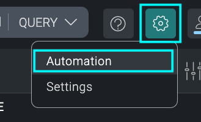
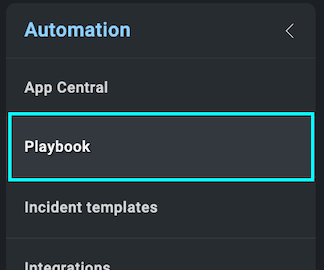
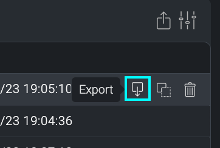
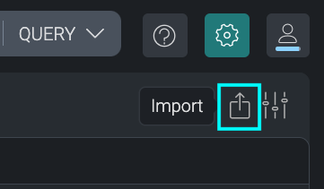

# Cloud SOAR Playbooks
Playbooks in Cloud SOAR, when exported, are delivered as a zip archive. However, contained in this archive is a JSON file that describes the flow of the playbook. When importing a playbook, is must be uploaded in a zip archive (containing the JSON playbook file).

### Whats included:
- Playbook zip archive (contains JSON file)
- Reference image of the playbook

### How to Import and Export Playbooks:
**Navigate to Settings (⚙) > Automation:**

**Open the Playbook management UI:**

**To *export* a playbook, hover over the playbook you wish to export and click the "export" icon:**

**To *import* a playbook, select the "import" icon in the upper right corner of the view. Select the **ZIP** archive you wish to import:**

### Using an Imported Playbook
Note: Once a playbook is imported, it is not functional out-of-the-box. You must edit the playbook to provide **Action Type** and **Action** parameters, though the inputs to these action should be pre-populated once selected.

For more information on working with playbooks in Cloud SOAR, please see [Cloud SOAR Playbooks](https://help-opensource.sumologic.com/docs/cloud-soar/automation/#playbook).

### To upload your own content:
Please see [Sumo Logic Community Ecosystem Apps FAQs](https://help.sumologic.com/docs/integrations/community-ecosystem-apps/#faq).

### To add review/comment to content:
Please provide a review/comment for this content by following the guidelines below:

- Select the **Comments** folder.
- Open the **Comments.json** file.
- Select Edit (pen icon).
- Add a new line below the current comments, and paste in your review/comment using the following schema:

        {
            "reviewer":"[githubid/name]",
            "ratings":{
                "overall":4,
                "use-case":5,
                "design":4,
                "technical":4
            },
            "review":"This app is very useful for knowing x, y, and z. It would be great if the dashboards were broken out by use case instead of being one big dashboard."
        }

- Select **Propose New Changes**.
- Submit **Pull Request**.

Code owners will review and merge your comments on the content to the repo.

Please see [How to add a review/comment to an app](https://help.sumologic.com/docs/integrations/community-ecosystem-apps/#how-do-i-add-a-reviewrating-to-an-app) for more information.