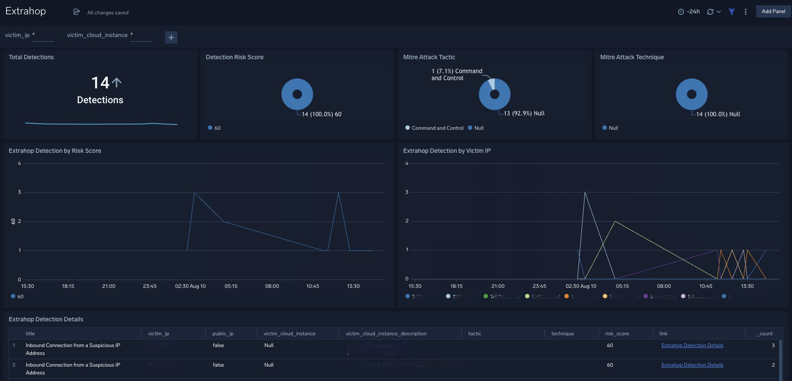
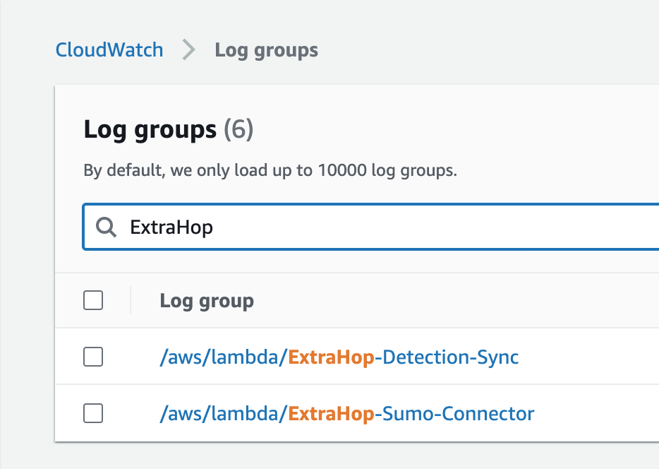
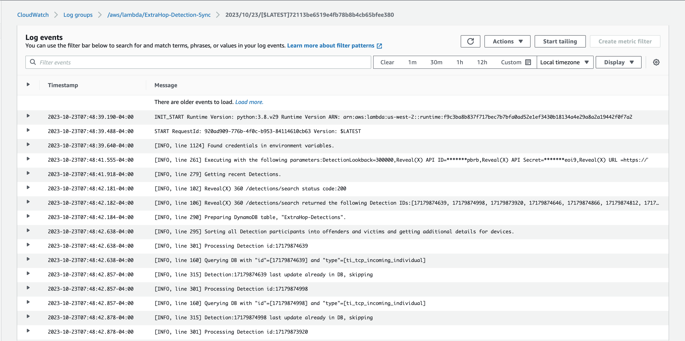
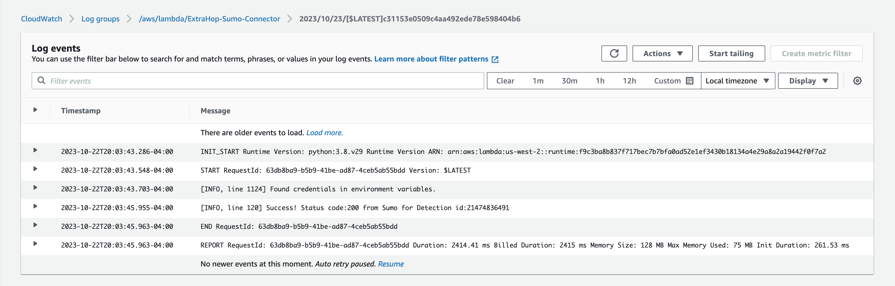

# Sumo Logic for ExtraHop Reveal(x) 360

Sumo Logic Community Content built for ExtraHop [Reveal(x) 360](https://docs.extrahop.com/current/eh-system-user-guide/#solutions) that is not published to the Sumo Logic [App Catalog](https://help.sumologic.com/docs/integrations/).

## Sumo Logic Dashboard



1. Download the Dashboard JSON file (`ExtraHop-Rx360-Detections-Dashboard.json`).
2. Optional: Find/replace all [Source Category](https://help.sumologic.com/docs/send-data/reference-information/metadata-naming-conventions/#source-category) references (e.g. `_sourceCategory=*extrahop*`) with your own (e.g. `_sourceCategory=extrahop/rx360/detections`).
3. [Import](https://help.sumologic.com/docs/get-started/library/#import-content) the content to your Sumo Logic Content Library.

## Data Collection

This solution sends new and updated Reveal(x) 360 [Detections](https://docs.extrahop.com/9.4/extrahop-trigger-api/#detection) to Sumo Logic using AWS resources.

### Requirements

1. ExtraHop Reveal(x) 360

   This solution requires Reveal(x) 360, whose Console is hosted in ExtraHop Cloud Services. It does not work with the Reveal(x) Enterprise (self-hosted) Console.

2. Sumo Logic

   This solution brings ExtraHop detections into a Sumo Logic [HTTP Logs and Metrics Source](https://help.sumologic.com/docs/send-data/hosted-collectors/http-source/logs-metrics/). Sumo Logic users may optionally forward this data to [Cloud SIEM Enterprise](https://www.sumologic.com/solutions/cloud-siem/), which is outside the scope of this solution.

3. AWS

   This solution uses a Lambda function to pull detections into a DynamoDB table using the [Reveal(x) 360 REST API](https://docs.extrahop.com/current/rx360-rest-api/), and a second Lambda function to process and forward those Detections to Sumo Logic. All AWS resources are created by deploying a Cloudformation template (`ExtraHop-SumoIntegration.yml`).

### Installation

1. download cloudformation template (`ExtraHop-SumoIntegration.yml`) and both python scripts (`ExtraHop-Detection-Sync.py` and `ExtraHop-Sumo-Connector.py`)
2. zip python scripts to create Lambda packages:
   ```
   for f in ExtraHop-*.py; do zip "${f%.*}.zip" "$f"; done
   ```
3. push cloudformation template and Lambda packages to your S3 Bucket:
   ```
   b=bucketname && k=s3key && aws s3 sync . s3://$b/$k --exclude "*" --include "ExtraHop-*.yml" --include "ExtraHop-*.zip"
   ```
4. note the Cloudformation template's S3 Object URL:
   ```
   r=$(aws configure get region) && s3objectUrl=https://$b.s3.$r.amazonaws.com/$k/ExtraHop-SumoIntegration.yml
   ```
5. deploy Cloudformation template using S3 URL (**use your parameter values**):
   ```
   aws cloudformation create-stack \
   --stack-name ExtraHop-SumoIntegration \
   --on-failure ROLLBACK \
   --capabilities CAPABILITY_NAMED_IAM \
   --template-url $s3objectUrl \
   --parameters ParameterKey=TenantName,ParameterValue=foo \
   ParameterKey=Rx360ApiId,ParameterValue=my-rx360-api-id \
   ParameterKey=Rx360ApiSecret,ParameterValue=my-rx360-api-secret \
   ParameterKey=SumoUrl,ParameterValue=https://sumourl.sumologic.com \
   ParameterKey=FunctionS3Bucket,ParameterValue=$b \
   ParameterKey=FunctionS3Key,ParameterValue=$k
   ```

### Template Reference

- `ExtraHop-SumoIntegration.yml` takes the following parameters:

  - Reveal(x) 360
    - TenantName: Tenant Name as indicated by your Reveal(x) 360 Console URL. E.g. "customername" in https://customername.cloud.extrahop.com
    - Rx360ApiId: Reveal(x) 360 API Id used by ExtraHop-Detection-Sync to retrieve Detections.
    - Rx360ApiSecret: Reveal(x) 360 API Secret used by ExtraHop-Detection-Sync to retrieve Detections.
  - Sumo Logic
    - SumoUrl: The URL of the Sumo Logic HTTP Logs and Metrics Source which will receive ExtraHop Reveal(x) Detections.
  - AWS
    - FunctionS3Bucket: Name of the S3 Bucket containing the ExtraHop-Detection-Sync and ExtraHop-Sumo-Connector lambda code. The Bucket must be in the same AWS Region as your function. The bucket can be in a different AWS account.
    - FunctionS3Key: The Amazon S3 key path where the ExtraHop-Detection-Sync.zip and ExtraHop-Sumo-Connector.zip lambda deployment packages reside.

- `ExtraHop-SumoIntegration.yml` creates the following AWS resources:

  | Logical ID                     | Type                            | Purpose                                                                              |
  | ------------------------------ | ------------------------------- | ------------------------------------------------------------------------------------ |
  | Rx360ApiUrlParameter           | AWS::SSM::Parameter             | URL for Reveal(x) 360 API                                                            |
  | DetectionSyncSecret            | AWS::SecretsManager::Secret     | Credentials for Reveal(x) 360 API                                                    |
  | SumoConnectorParameter         | AWS::SSM::Parameter             | URL for Sumo Logic HTTP Logs and Metrics Source                                      |
  |                                |                                 |                                                                                      |
  | DetectionSyncEventRule         | AWS::Events::Rule               | invokes DetectionSyncFunction every 5m                                               |
  | DetectionSyncPermission        | AWS::Lambda::Permission         | enables EventRule to invoke Function                                                 |
  | DetectionSyncLookbackParameter | AWS::SSM::Parameter             | each DetectionSyncFunction invocation will retrieve detections from this time period |
  | DetectionSyncFunction          | AWS::Lambda::Function           | syncs detections to DetectionSyncTable                                               |
  | DetectionSyncPolicy            | AWS::IAM::ManagedPolicy         | specifies AWS permissions used by Function                                           |
  | DetectionSyncRole              | AWS::IAM::Role                  | Lambda execution role for Function                                                   |
  |                                |                                 |                                                                                      |
  | DetectionSyncTable             | AWS::DynamoDB::Table            | stores new and updated detections                                                    |
  |                                |                                 |                                                                                      |
  | DetectionsTableStream          | AWS::Lambda::EventSourceMapping | streams detections from DetectionSyncTable to SumoConnectorFunction                  |
  |                                |                                 |                                                                                      |
  | SumoConnectorFunction          | AWS::Lambda::Function           | processes detections and forwards to Sumo Logic                                      |
  | SumoConnectorRole              | AWS::IAM::Role                  | Lambda execution role for Function                                                   |

### Troubleshooting

Each Function invocation is recorded to a dedicated CloudWatch Log group:



Refer to the most recent Log stream to look for issues retrieving detections from ExtraHop or sending them to Sumo Logic. Each function's default logging level is `INFO`, but can be changed to `DEBUG` in the following stanza:

```
# set up logging
logging.basicConfig(
    format="[%(levelname)-4s, line %(lineno)d] %(message)s",
    datefmt="%d-%m-%Y:%H:%M:%S",
    level=logging.INFO,
    force=True,
)
```

When working correclty, the `ExtraHop-Detection-Sync` function's log output should show successful authentication to the Reveal(x) 360 API, successfully search for detections from the lookback period, and process them. Example screenshot:


When working correclty, the `ExtraHop-SumoConnector` function's log output should show successful transmission of each detection id to Sumo Logic. Example Screenshot:


## Reviews & Ratings

To review, comment on, or rate this content, follow the process in the Community Content Catalog FAQ entry [How do I add comments, reviews, and ratings to an App?](https://help.sumologic.com/docs/integrations/community-ecosystem-apps/#how-do-i-add-comments-reviews-and-ratings-to-an-app).

## Contributing

Please see [Contributing Guidelines](https://help.sumologic.com/docs/integrations/community-ecosystem-apps/#contributing-guidelines).

Authors: Jeff D (Sumo Logic SE), Thomas S (ExtraHop SE)
Contributors: Beth G (Sumo Logic SE)
