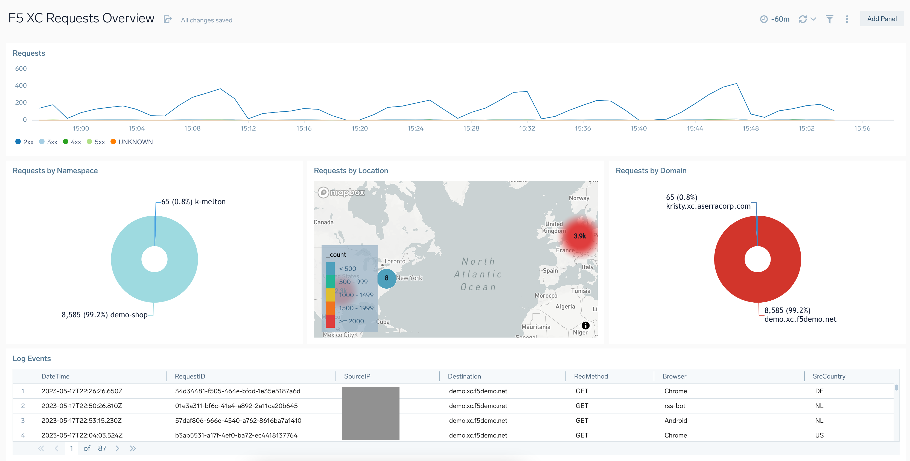
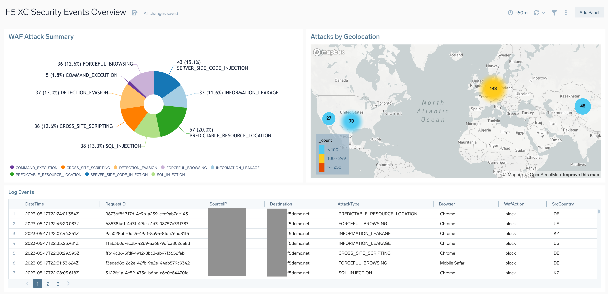

# Sumo Logic for F5
F5 Distributed Cloud (XC) Services provides customers with a global cloud native platform that can deploy, manage, and secure their applications in hybrid environments (public cloud, private data centers, or colocations). ADN and CDN services are also available.

The F5 XC platform includes the Global Log Receiver, which can be configured to securely send logs to a Sumo Logic HTTP endpoint. Configuration can be done through the F5 XC Console UI.

The F5 Distributed Cloud (XC) Services collection includes:

• Dashboard – F5 XC Requests Overview
• Dashboard – F5 XC Security Events Overview

### Setup/Collecton:
Global log streaming can be configured for streaming logs from all shared namespaces in your account, or a specific list of shared namespaces that you can specify.

The following steps will configure a global log receiver to send log events to a Sumo Logic HTTP endpoint. Additionally, the following video provides a guided walkthrough of the configuration process. The video walkthrough is locate at - https://youtu.be/VmzcdBOKoeY

**Step 1: To create a global log receiver**

1. In the F5® Distributed Cloud Console, navigate to the Shared Configuration service.
2. Select Manage > Global Log Receiver.
3. Click add Global Log Receiver button

**Step 2: Configure global log receiver properties**

1. Within the Global Log Receiver section, enter a name in the metadata section. Optional: set labels and add a description.
2. Select Request Logs or Security Events for the Log Type field. Request logs are set by default.
3. Select events to be streamed based on namespace from the following options:
a. Select logs from the current namespace - streams logs from the shared namespace.
b. Select logs from all namespaces - streams logs from all namespaces.
c. Select logs in specific namespaces - streams logs from specified namespaces. Enter the namespace name in the displayed namespaces list. To add more than one namespace, select Add item.

Note: Namespaces provide logical grouping and isolation of objects within a distributed cloud tenant.

**Step 3: Sumo Logic Settings**

1. Select Sumo Logic for the Receiver Configuration.
2. Navigate to Sumo Logic > Manage Data > Collection and copy the desired HTTP Source URL.
3. Navigate back to F5 XC global log receiver configuration screen, select ‘Configure’ and paste in the HTTP Source to blindfold. Select ‘Apply’.
4. Select Save & Exit to complete creating the global log receiver. Verify that logs are received into your Sumo Logic account.

### To use the content:
- Download the JSON file(s).
- Find/replace all Source Categories within the JSON with your own Source Category (Ex: sourceCategory=yourSourceCategory).
- [Import](https://help.sumologic.com/docs/get-started/library/#import-content) the content to your desired folder location in Sumo Logic.

### To upload your own content:
Please see [Sumo Logic Community Ecosystem Apps FAQs](https://help.sumologic.com/docs/integrations/community-ecosystem-apps/#faq).

### To add review/comment to content:
Please provide a review/comment for this content by following the guidelines below:

- Select the **Comments** folder.
- Open the **Comments.json** file.
- Select Edit (pen icon).
- Add a new line below the current comments, and paste in your review/comment using the following schema:

        {
            "reviewer":"[githubid/name]",
            "ratings":{
                "overall":4,
                "use-case":5,
                "design":4,
                "technical":4
            },
            "review":"This app is very useful for knowing x, y, and z. It would be great if the dashboards were broken out by use case instead of being one big dashboard."
        }

- Select **Propose New Changes**.
- Submit **Pull Request**.

Code owners will review and merge your comments on the content to the repo.

Please see [How to add a review/comment to an app](https://help.sumologic.com/docs/integrations/community-ecosystem-apps/#how-do-i-add-a-reviewrating-to-an-app) for more information.

Creator: Gregory Coward (F5)