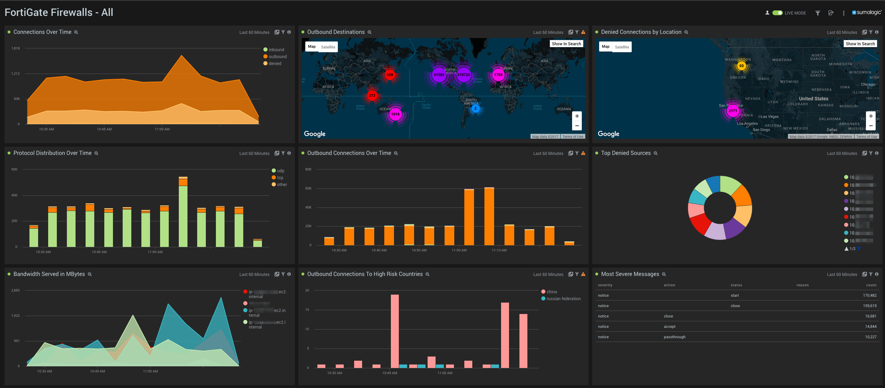

# Sumo Logic for Fortinet

Contains all Fortinet technology and product lines for which Sumo Logic has content for.

## Usage:

> **NOTE:** you **MUST** find and replace `$$Fortigate` with a suitable string to scope your fortigate logs. ie: `_sourceCategory=yourSourceCategory`

>For more information, see [Fortinet documentation](http://docs.fortinet.com/uploaded/files/1048/fortigate-loggingreporting-40-mr3.pdf)
