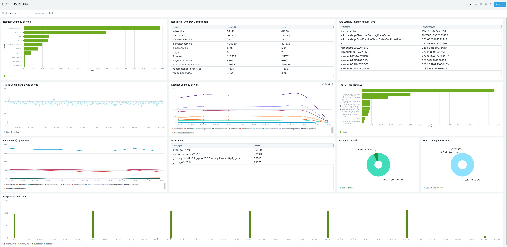

# Sumo Logic for Google Cloud Run
Sumo Logic Community Content built for Google Cloud Run that has not been published to the [App Catalog](https://help.sumologic.com/docs/integrations/).

For instructions on how to collect logs and metrics for use with content, please see [Sumo Logic Documentation](https://help.sumologic.com/docs/send-data/).

This dashboard provides inforamtion sbout Applications running on Google Cloud Run

### To use the content:
- Deploy the Sumo Logic Helm chart for Kubernetes to collect logs and metrics and; send them to Sumo Logic
- Create the Field pod_labels_serving.knative.dev/service by naviagting to Manage Data > Settings > Fields. This ensures that your logs are tagged with relevant metadata, which is required by the app dashboard.
- Download the JSON file(s).
- Find/replace all Source Categories within the JSON with your own Source Category (Ex: sourceCategory=yourSourceCategory).
- [Import](https://help.sumologic.com/docs/get-started/library/#import-content) the content to your desired folder location in Sumo Logic.

### To upload your own content:
Please see [Sumo Logic Community Ecosystem Apps FAQs](https://help.sumologic.com/docs/integrations/community-ecosystem-apps/#faq).