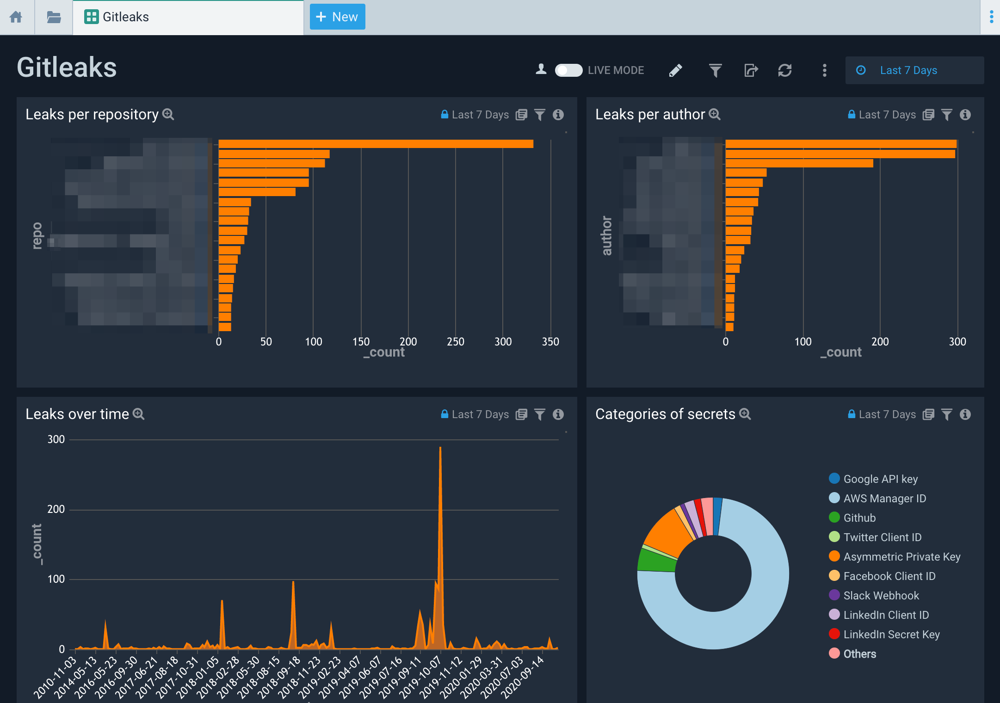

# Sumo Logic for Gitleaks
Sumo Logic Community Content built for Gitleaks that is not published to the [App Catalog](https://help.sumologic.com/docs/integrations/).

The dashboard assumes the Gitleaks' reporting format is json.

### To use the content:
- Download the JSON file(s).
- Find/replace all Source Categories within the JSON with your own Source Category (Ex: sourceCategory=yourSourceCategory).
- [Import](https://help.sumologic.com/docs/get-started/library/#import-content) the content to your desired folder location in Sumo Logic.

### Collection:
For instructions on how to collect logs and metrics for use with content, please see [Sumo Logic Documentation](https://help.sumologic.com/docs/send-data/). See [Gitleaks](https://github.com/zricethezav/gitleaks) for more details on the tool.

### To upload your own content:
Please see [Sumo Logic Community Ecosystem Apps FAQs](https://help.sumologic.com/docs/integrations/community-ecosystem-apps/#faq).

Author: Lars-Göran Hakamo