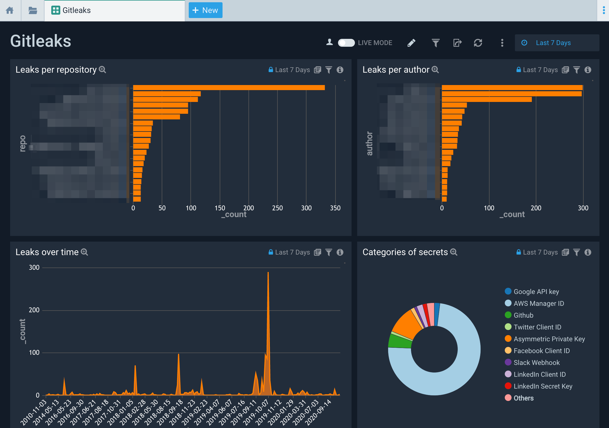

# Sumo Logic for Gitleaks

## Usage:

**NOTE:** you **MUST** find and replace `$$Gitleaks` in the content json with a suitable string to match your Gitleaks report logs ie. `_sourceCategory=yourSourceCategory`

The dashboard assumes the Gitleaks' reporting format is json.

See [Gitleaks](https://github.com/zricethezav/gitleaks) for more details on the tool.

Author: Lars-Göran Hakamo

Changelog:
v0.1 - Initial version.
