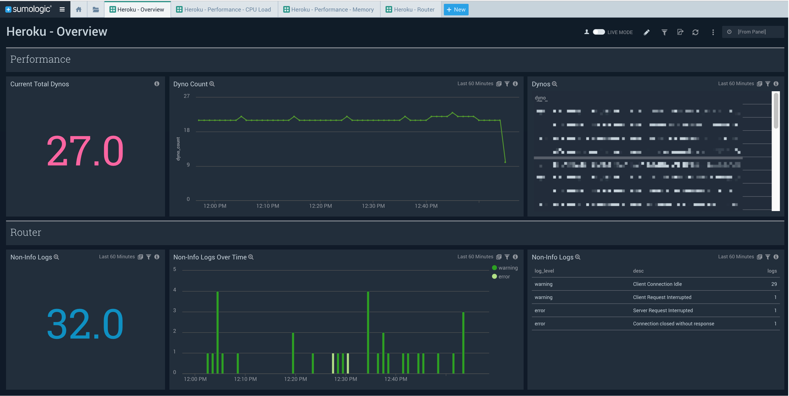
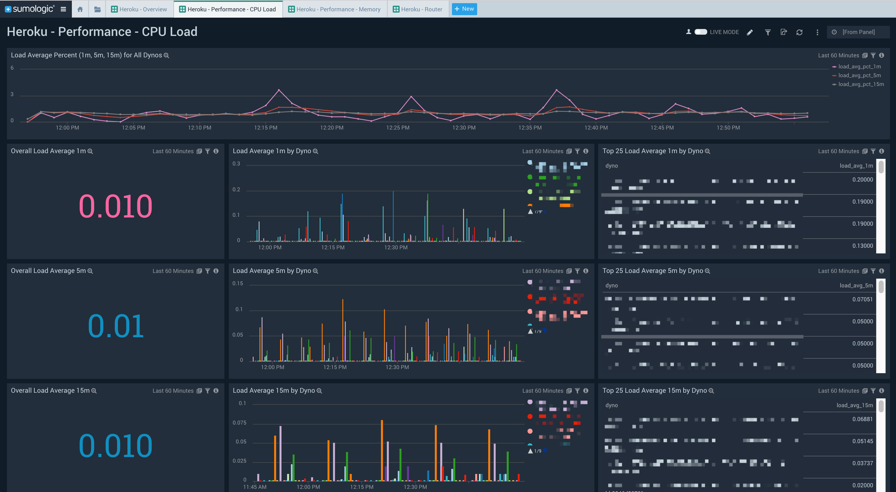
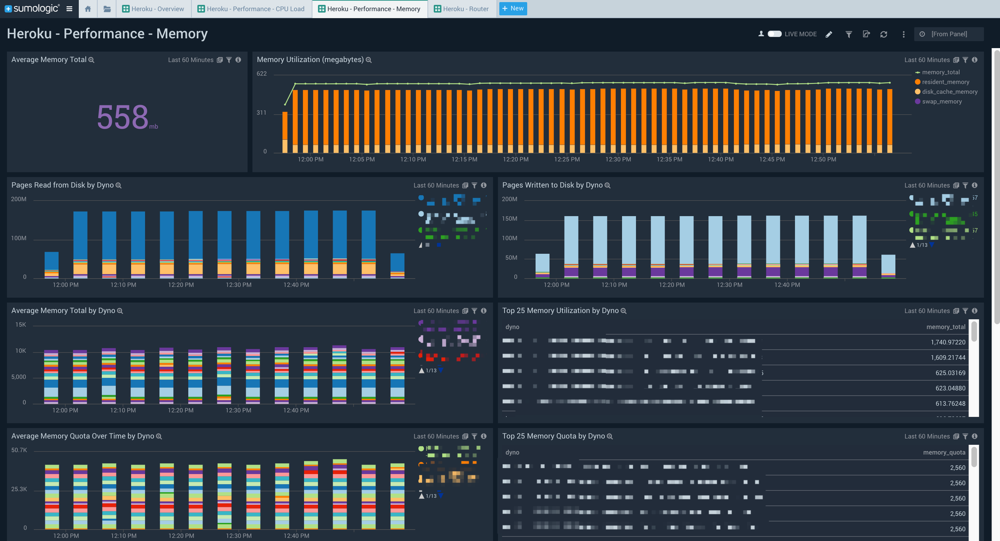
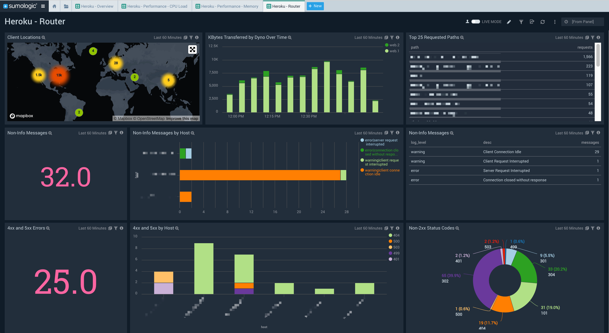

# Sumo Logic for Heroku
Sumo Logic Community Content built for Heroku that is not published to the [App Catalog](https://help.sumologic.com/docs/integrations/).

For instructions on how to collect logs and metrics for use with content, please see [Sumo Logic Documentation](https://help.sumologic.com/docs/send-data/).

This app for contains a dashboard for an overview, CPU/memory performance, and routers.

### Collection:
Heroku logs are collected through [log drains](https://devcenter.heroku.com/articles/log-drains). Ideally, these logs should be forwarded to a [Sumo Logic HTTPS Source](https://help.sumologic.com/Send-Data/Sources/02Sources-for-Hosted-Collectors/HTTP-Source). 

Additional documentation from Heroku on required logging:

- [HTTP Routing - Heroku Router Log Format](https://devcenter.heroku.com/articles/http-routing#heroku-router-log-format)
- [Heroku Labs: log-runtime-metrics](https://devcenter.heroku.com/articles/log-runtime-metrics)

### To use the content:
- Download the JSON file(s).
- Find/replace all Source Categories within the JSON with your own Source Category (Ex: sourceCategory=yourSourceCategory).
- [Import](https://help.sumologic.com/docs/get-started/library/#import-content) the content to your desired folder location in Sumo Logic.

### To upload your own content:
Please see [Sumo Logic Community Ecosystem Apps FAQs](https://help.sumologic.com/docs/integrations/community-ecosystem-apps/#faq).