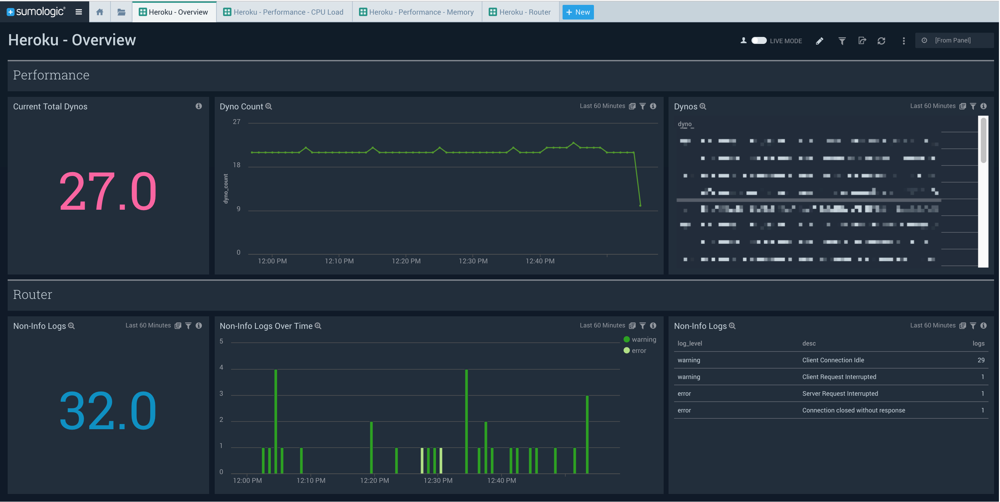
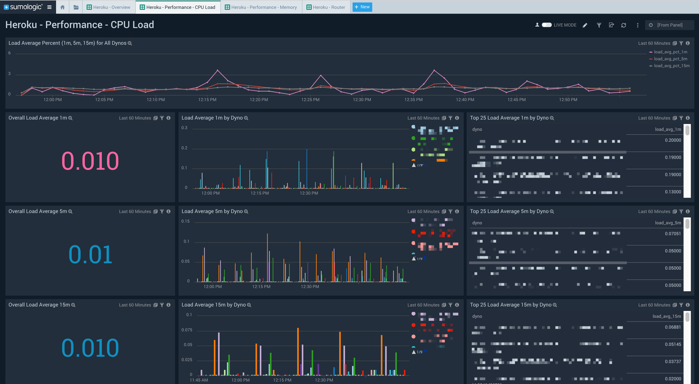
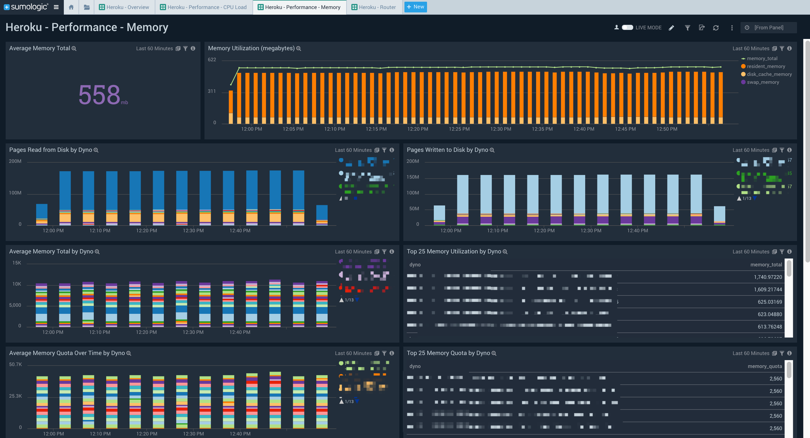
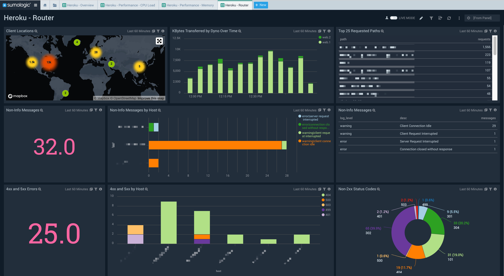

# Sumo Logic for Heroku

This is an app for Heroku. It contains a dashboard for an overview, performance, and routers. 

Heroku logs are collected through [log drains](https://devcenter.heroku.com/articles/log-drains). Ideally, these logs should be forwarded to a [Sumo Logic HTTPS Source](https://help.sumologic.com/Send-Data/Sources/02Sources-for-Hosted-Collectors/HTTP-Source). 

Additional documentation from Heroku on required logging:

* [HTTP Routing - Heroku Router Log Format](https://devcenter.heroku.com/articles/http-routing#heroku-router-log-format)
* [Heroku Labs: log-runtime-metrics](https://devcenter.heroku.com/articles/log-runtime-metrics)

## Setup

### Update Source Categories

Update `*$$HEROKULOGS*` to `_sourceCategory=yourSourceCategory`

### Import App

Once imported, the app should automatically be setup to query against Heroku logs. 

## Additional Dashboards

