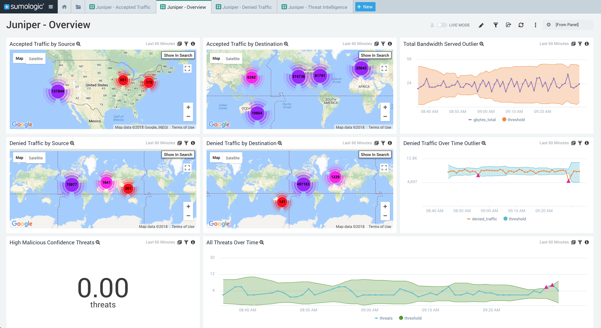
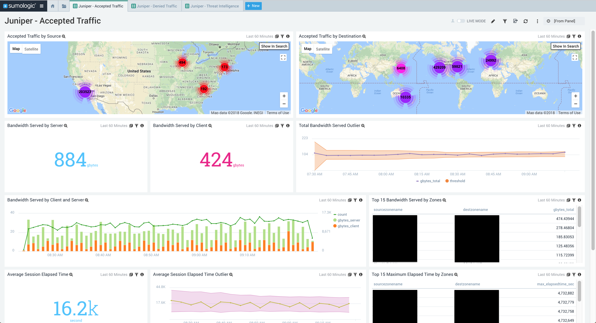
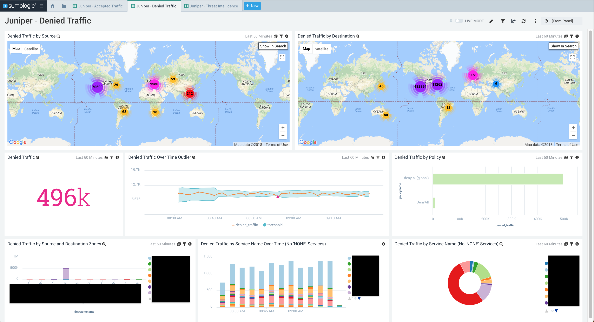
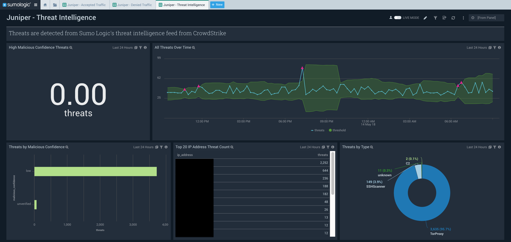

# Sumo Logic for Juniper Firewall
Sumo Logic Community Content built for Juniper Firewall that is not published to the [App Catalog](https://help.sumologic.com/docs/integrations/).

This is an app for the Juniper Firewall. It contains dashboard for an overview, accepted traffic, denied traffic, and threats per the Sumo Logic Integrated Threat Intelligence. 

### To use the content:
- Setup Field Extraction Rules: The Juniper app's queries heavily rely on Field Extraction Rules found in juniper-field-extraction-rules.txt. Setup the FERs prior to installing the app. Optionally, you can modify the dashboards to use query-time parsing instead of FERs.
- Setup Threat Intel Scheduled Views: The Juniper app has a threat dashboard for threats detected by Sumo Logic's integrated threat intelligence with Crowdstrike. This dashboard relies upon the IP Scheduled View in the [Threat Intel Quick Analysis - Optimized](https://github.com/SumoLogic/sumologic-content/blob/master/Sumo-Logic-Tools/Threat_Intelligence_Optimized/scheduled_views.txt) app (Index Name: threat_intel_ip_address).
- Download the JSON file(s).
- Find/replace all Source Categories within the JSON with your own Source Category (Ex: sourceCategory=yourSourceCategory).
- [Import](https://help.sumologic.com/docs/get-started/library/#import-content) the content to your desired folder location in Sumo Logic.

### Collection:
For instructions on how to collect logs and metrics for use with content, please see [Sumo Logic Documentation](https://help.sumologic.com/docs/send-data/). Juniper logs are collected through syslog, and the Threat Intelligence relies on the [Threat Intelligence Quick Analysis Optimized](https://github.com/SumoLogic/sumologic-content/tree/master/Sumo-Logic-Tools/Threat_Intelligence_Optimized) scheduled view for IP addresses. 

### To upload your own content:
Please see [Sumo Logic Community Ecosystem Apps FAQs](https://help.sumologic.com/docs/integrations/community-ecosystem-apps/#faq).

### To add a review to content:
Please follow [How to add a review/rating to an app](https://help.sumologic.com/docs/integrations/community-ecosystem-apps/#how-do-i-add-a-reviewrating-to-an-app)