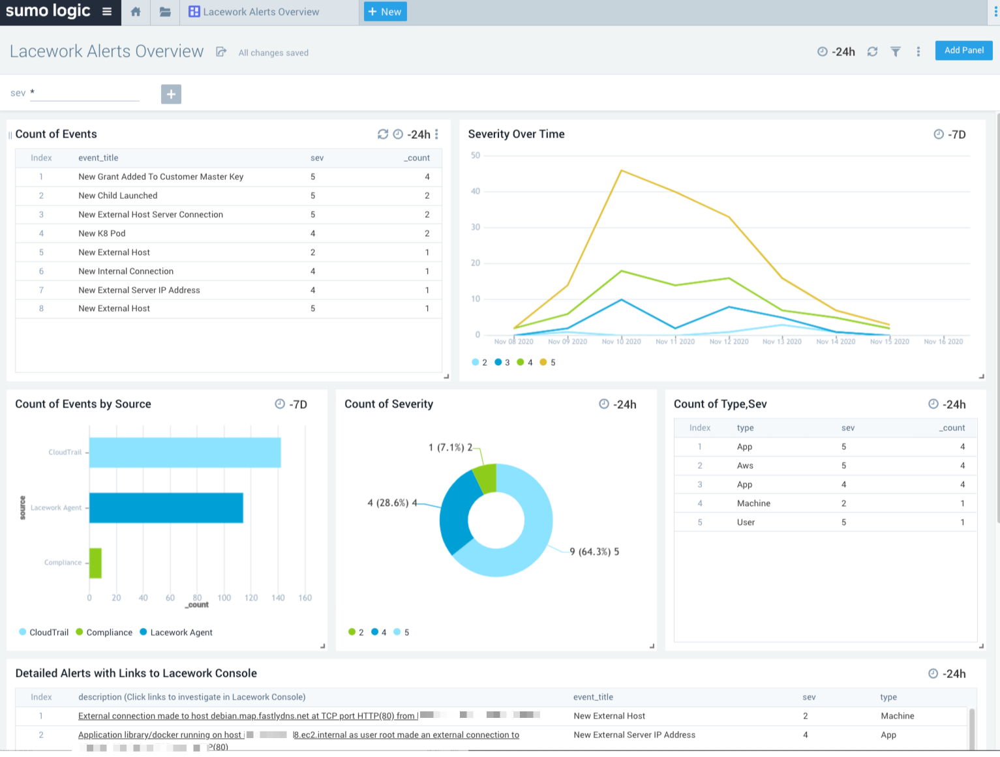

# Lacework Alerts Overview Dashboard

This is a dashboard for analyzing, trending and investigating your Lacework Alerts

This dashboard will allow you to see alerts from your Lacework account, including compliance, agent, and account based alerts. You can also filer by alert severity in the dashboard to focus on what is important to you.

# Collection of Alerts

This dashboard is based off alerts from your Lacework account.

If you aren't already sending your Lacework alerts to Sumo Logic, you can follow the simple steps below:

1. Create an https logs source in Sumo Logic. This can be done on a new or existing hosted collector in your account. Follow [this document](https://github.com/SumoLogic/sumologic-content/issues) to create the https logs source. Note the endpoint that is created, this will be used in step 2. Ensure a value is input for _sourceCategory.

2. Now you can create a custom Lacework webhook alert channel that is pointed toward the Sumo Logic https logs endpoint created in step 1. Follow [this Lacework document](https://support.lacework.com/hc/en-us/articles/360034367393-Webhook) to create the webhook alert channel. The value for the "Webhook URL", will be the endpoint you created in step 1.

# Dashboard Setup

Download the json content for the dashboard, [stored here](Applications_and_Dashboards/Lacework_Alerts_Overview.json)

Open the .json file in a text editor of your choosing and replace the string of `$$lacework` to the value you have setup in your Sumo Logic account.

Import the dashboard into your Library. [Follow the steps here.](https://help.sumologic.com/05Search/Library/Export-and-Import-Content-in-the-Library#import-content-in-the-library)
