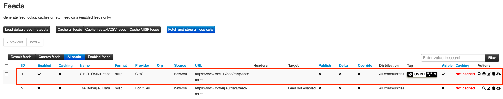
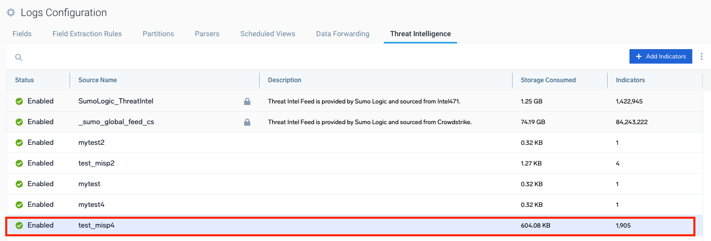

Now Sumo support two types of Threat Intels as the following.
* [Legacy Threat Intel](https://help.sumologic.com/docs/cse/administration/create-custom-threat-intel-source/): Indicators are only used in Cloud SIEM
* [Unified Threat Intel](https://help.sumologic.com/docs/security/threat-intelligence/upload-formats/): Indicators are used in Cloud SIEM and planned to be used in Log Analytics Platform as well.

This is the script, run.py which download indicators from MSIP and upload those to [Unified Threat Intel](https://help.sumologic.com/docs/security/threat-intelligence/upload-formats/).

Below is the way to run the script.
It needs env.ini file in the same directory where the script, run.py, is located.

```
hostname:~/misp # ls
env.ini  run.py
```

Please modify env.ini referring to the comments in the file.
The script will require python3 to run the script.
```
hostname:~/misp # python3 run.py
```
You can run this script regularly once a day or once an hour. If you want to run this once an hour, please modify the value of mist_last in env.ini file from 24h to 1h.

From my test, I was able to successfully upload 1,905 indicators from CIRCL OSINT Feed to Sumo as the attached screenshot.
[The feed I tested from MISP]

[Threat Intel Source in Sumo]
