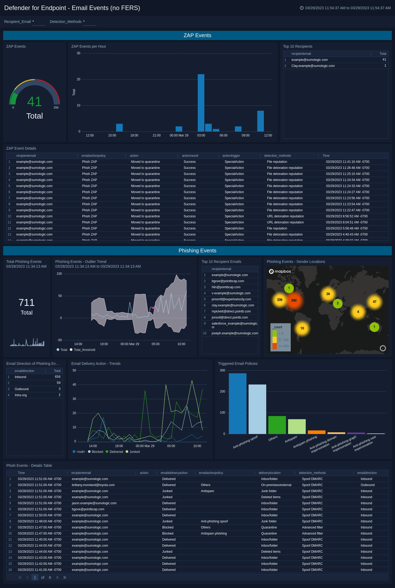

# Content Details

The above dashboard can be installed to work out of the box by importing the "defender4endpoint_dashboard.json" file into your Sumo account. Please see the README.md file in the Defender_4_EndPoint directory for more details on this process. This dashboard does not utilized Field Extraction Rules (FERs) and therefore dashboard load times will be delayed.

As such, it is recommended that you also install the FERs contained in the "defender4endpoint_dashboard.json" file. Once FERs are installed, you can then utilize the dashboard contained in the "defender4endpoint_dashboard_FERs.json" file.
