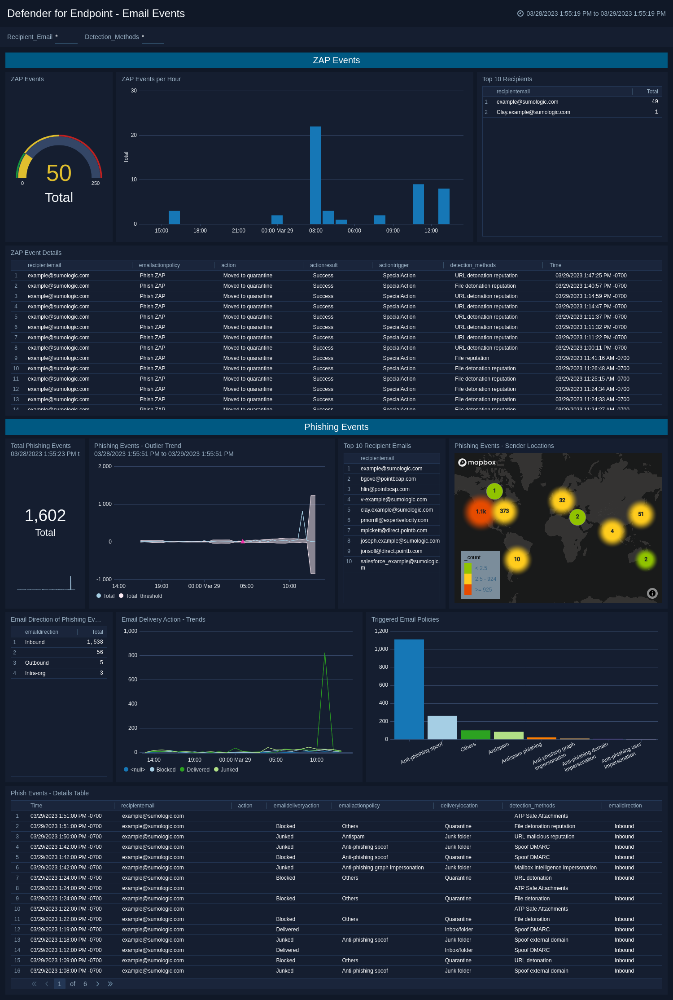

# Content Details

The dashboard below can be set up quickly and easily by importing the 'defender4endpoint_dashboard.json' file into your Sumo account. Please see the README.md file in the Defender_4_EndPoint directory for more details on this process. This dashboard does not use Field Extraction Rules (FERs), so dashboard load times may be delayed.

It is recommended that you also install the FERs in the file. Once installed, you can use the dashboard in the 'defender4endpoint_dashboard_FERs.json' file.

