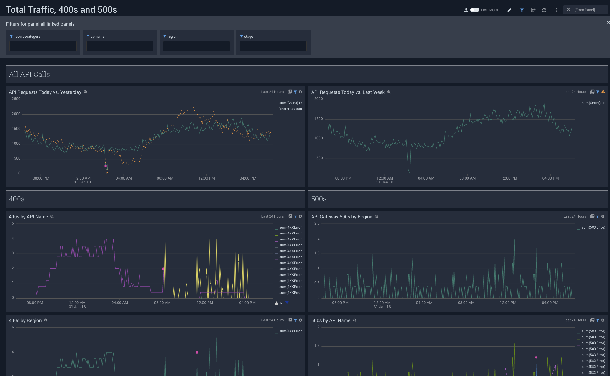
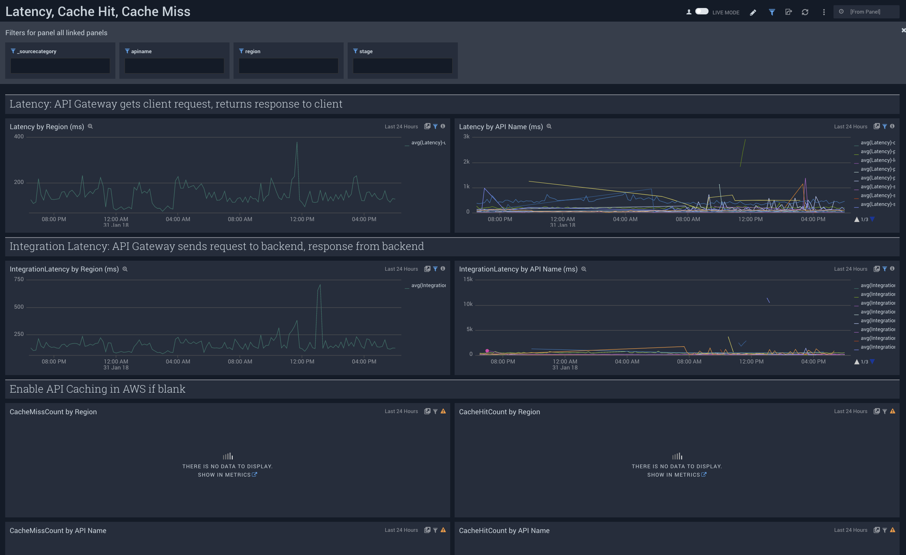
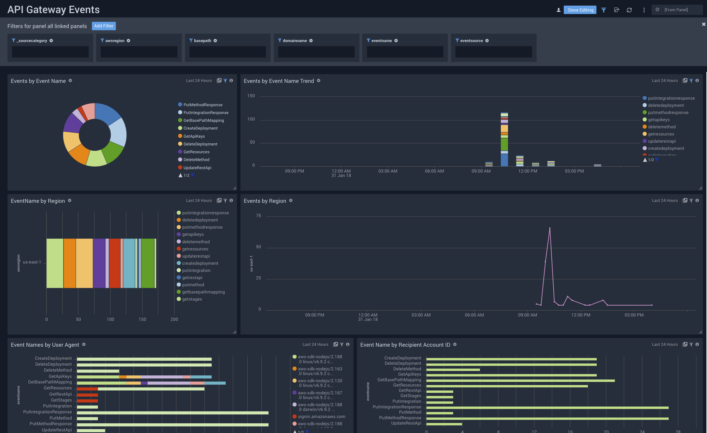

# Sumo Logic application for AWS APIGateway
 
Contains Dashboards for AWS API Gateway

To use the content:
1. Collect AWS Cloudtrail and Cloudwatch Metrics for API Gateway
2. Download the raw JSON file(s) and search for (CTRL+F / CMD+F) `$$Cloudtrail` to replace with `_sourceCategory=yourSourceCategory`

This dashboard provides show the total number of API hits and the status code breakdown of 400s and 500s.

This dashboard provides API Gateway latency performance metrics.

This dashboard provides the breakdown of events for the API Gateway

See [Sumo Logic Documentation](https://help.sumologic.com/) for instructions on how to collect logs and metrics for use with content.

Guidelines PLEASE READ:

To contribute to subfolders or create new subfolders here, please follow the standards below:

1. All application, dashboard and search content in .json format. Please use descriptive naming such as:
   a. Company_TechnologyLine_ContentFunction. E.g. AWS_Kinesis_Errors.json or Sentinel_Vanguard_All.json

2. Relevant screenshot(s) in .png or equivalent format. Naming similar or equivalent to .json content it represents.

3. Create/update a README.md file (like this one) within the folder to track:
   a. Technology and product lines, authors, versions, etc.
   b. Link(s) to relevant 3rd party documentation to specify what types of data need to be collected for content to work.

