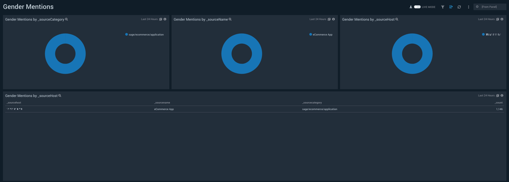

# Sumo Logic for GDPR Privacy Insights
Sumo Logic Community Content built for GDPR Privacy Insights that is not published to the [App Catalog](https://help.sumologic.com/docs/integrations/).

Added Privacy Insights Main Dashboard, accompanying 8 seed dashboards

### To use the content:
- Download the JSON file(s).
- Find/replace all Source Categories within the JSON with your own Source Category (Ex: sourceCategory=yourSourceCategory).
- [Import](https://help.sumologic.com/docs/get-started/library/#import-content) the content to your desired folder location in Sumo Logic.

### Collection:
For instructions on how to collect logs and metrics for use with content, please see [Sumo Logic Documentation](https://help.sumologic.com/docs/send-data/).

Please ensure that all applicable and relevant sources of data that might contain GDPR-sensitive or privacy information has been ingested and appropriately tagged into your Sumo Logic service. This will make correlation, investigation and targeting/separation of your privacy information much more efficient down the line.

### Using the dashboards: 
Privacy Dashboards are intended to cast a wide net so that you can gain visibility into what, if any, GDPR-sensitive or privacy information exists in your relevant data. They are also intended to find certain specific information that are well-known and predefined due to specific Privacy Law Articles. The dashboards come with filters that allow you to search for common keywords, patterns, PII and other GDPR-related types within the data set(s) the Privacy Application is installed against. 
 
The Dashboards are NOT intended to do the following: 
- Automatically remove privacy/GDPR-sensitive information from your data sets. 
- Provide targeted views into sensitive fields, types and categories for precision investigations and monitoring. 
- Provide alertable correlations. 
- Weed out false positives. 
 
The Dashboards ARE intended to do the following: 
- Give you visibility into where and what the sensitive data is. 
- Allow you to decide your actions, such as: 
- Do you want to be logging that information? 
- Do you want to make changes pre-ingestion so that you are not storing that 
information any longer, regardless of data platform? 
- Do you want to set up hashing/masking to obfuscate at ingestion time with Sumo Logic processing rules? 
- Do you wish to logically compartmentalize data sets with sensitive information into a separate partition/index as a management architecture? 
- Give you the ability to identify, drill down and look across other data sets not being actively analyzed by the dashboards to find other potential sources of sensitive information

### Common workflows: 
Below are some common scenarios and accompanying solutions that are possible with Privacy Analysis in Sumo Logic. Please note these are not all-inclusive and are intended to provide examples of customer workflows that may occur. 
 
**A. Potential Privacy Information Identification and Drill-Down​:**
Depending on the amount of sensitive information in your data, the Privacy dashboard panels may be pre-populated with searches that have already found potential customer-privacy information in your data sets. If this is the case, a common action flow that you may wish to follow is: 
   1. Ask: Is this a wide-net or specific information capture?​ Wide-net capture refers to the dashboard panels that contain ​potential​ privacy information e.g. what might look like addresses, phone numbers, IDs, etc. Specific Capture refers to dashboard panels that are pulling recognized formats of the above types of data out automatically from your data. 
   2. If Wide-Net Capture Information​ - ​Then​: click through the panels and linked dashboards to access Sumo Logic Search. Identify the raw log messages and the fields that are being parsed out by wide-net capture and decide if those fields constitute customer privacy information as applicable for your organization. If they are categories, then please refer to Scenarios C, D, or E as required. 
   3. If Specific Capture Information - Then​: click through the panels and linked dashboards to access Sumo Logic Search. Identify the raw log messages and the fields that are being parsed out by specific capture. These have already been categorized according to Privacy Law and we advise customers that such information be separated, excised, masked, or hashed. Please refer to Scenario D and/or E to continue. 
 
**B. Identifying Privacy-Sensitive Information in All of Your Data​:** 
If your Privacy Insights Application has identified wide-net or specific capture information in your data, you may want to look across other data sets you are sending to Sumo Logic to check for similar information that you had no prior privacy visibility into. There are 2 ways to do this: 
   1. Install the Privacy Insights Application against your other data sets and refer to Scenario C to continuously monitor and/or alert on similar data sets. 
   2. Drill-down into Search from the dashboard panels as described in Scenario A and utilize the ​regex parsers​ within the search window to search against your other data sets within your applicable time window. 

In addition, if there are other data sets that may contain privacy or GDPR-sensitive information, ingesting them into Sumo Logic and following the example scenarios here will provide wide-net and specific capture visibility across your organization and environments. 
 
**C. Privacy Monitoring and Alerting​:**
Once you have identified all relevant privacy information in your data, you can utilize Sumo Logic to continuously monitor, alert and discover privacy information across your org. 
 
   - Monitoring​ - you can use the OOTB Privacy Insights Application Dashboards or mix-match/create your own panels with the Privacy Insights Application search code as “seed” searches. More information on Dashboard creation here: https://help.sumologic.com/Dashboards-and-Alerts/Dashboards 
 
   - Alerting​ - akin to Monitoring, you can use the Privacy Insights App panels and searches to create alerts for the appearance of privacy information, or create your own alerts as described here: ​https://help.sumologic.com/Dashboards-and-Alerts/Alerts 
 
 
   - Scheduled Views​ -  a very powerful way to search across larger data sets over a longer period of time for privacy information as well as other use cases: https://help.sumologic.com/Manage/Search-Optimization-Tools/Manage-Scheduled-Views 
 
**D. Logically Separating Identified Privacy Data​:** 
Partitioning in Sumo Logic is a way to logically separate certain data sets from others. This affords multiple benefits as described ​here​. This may be especially important for your organization if you foresee that your customer privacy-related information will need to be searched on optimally and/or must be retained for certain periods with maximum or minimum expiration dates. 
 
**E. Masking/Hashing Identified GDPR Data​:** 
Once you have identified certain fields in your data sets to contain privacy information, you can decide to mask and/or hash that information so it is not shown in clear text in accordance with privacy law or requirements. This is done with Sumo Logic ​Processing Rules​. 

## Additional Dashboards

### To upload your own content:
Please see [Sumo Logic Community Ecosystem Apps FAQs](https://help.sumologic.com/docs/integrations/community-ecosystem-apps/#faq).