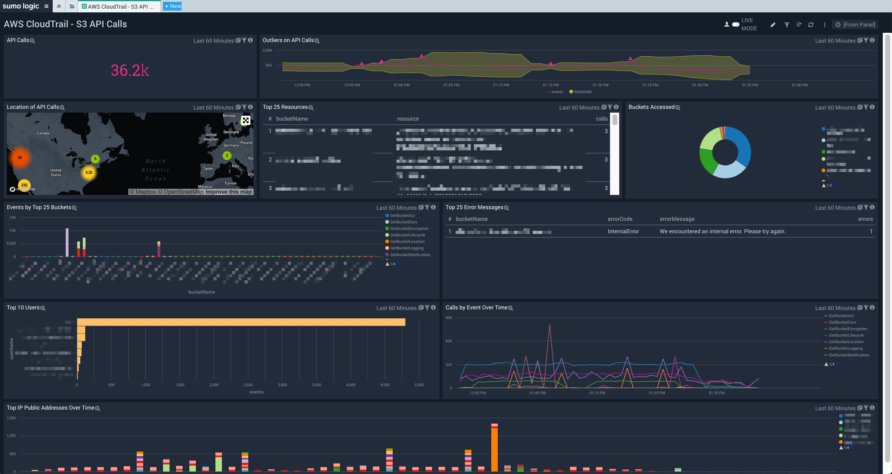

# AWS CloudTrail - S3 API Calls

This is a dashboard for S3 API Calls logged to AWS CloudTrail.

## Setup

### Enable S3 API Call logging in CloudTrail

Follow step 7 in the [Creating a Trail](https://docs.aws.amazon.com/awscloudtrail/latest/userguide/cloudtrail-create-a-trail-using-the-console-first-time.html) document (For S3 buckets:...). This will enable [Logging Amazon S3 API Calls by Using AWS CloudTrail](https://docs.aws.amazon.com/AmazonS3/latest/dev/cloudtrail-logging.html).

### Update Source Categories

Update source categories to the appropriate one(s):

CloudTrail queries: Update `$$cloudTrail` to `_sourceCategory=yourSourceCategory` 

### Import App

Once imported, the app should automatically be setup to query against CloudTrail S3 API Call logs. 