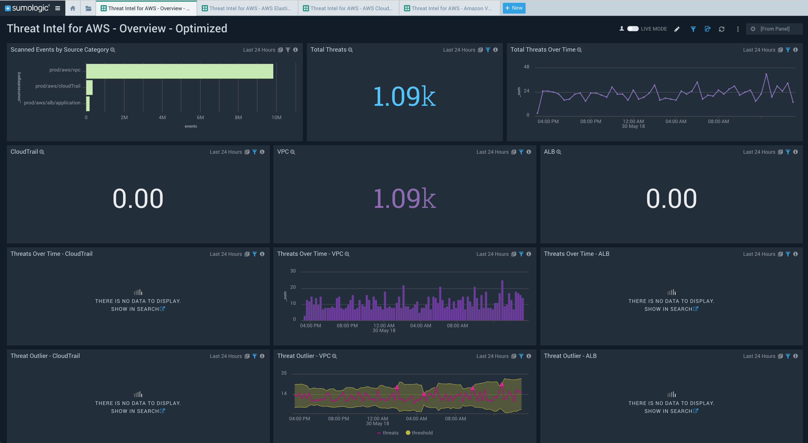

# Threat Intelligence for AWS - Optimized

While the included Threat Intelligence for AWS app is a great place to start for valuable threat intelligence, it still needs to be optimized to get the most value out of it.  This is an optimized version of the included app.

Note that the app in the Sumo Logic App Catalog is for ELB - Classic, and this version is currently for ELB - Application. Minor tweaking may be necessary for ELB - Classic.

The concept of this optimized version of the app is based on the [Threat Intelligence Quick Analysis - Optimized](https://github.com/SumoLogic/sumologic-content/tree/master/Sumo-Logic-Tools/Threat_Intelligence_Optimized) app. The Threat Intelligence for AWS - Optimized app is specifically for AWS core services (VPC, CloudTrail, and ALB). The Quick Analysis one is more general and not vendor-specific.

## Setup

### Setup Scheduled Views

Scheduled Views are key to making the Threat Intelligence optimized to rapidly query.  These scheduled views are created to search across *all* data ingested into Sumo Logic. They can be grouped in different ways including Source Category and Source.  Add additional metadata as needed.  

Using the *scheduled-views-threat-intel-aws-optimized.txt* file, create a new scheduled view for each in the list. Change your scope as necessary (e.g., replace $$vpc with your appropriate metadata tags and scope, ex. "_sourceCategory=yourSourceCategory").

Once created, it will take time to initially run the scheduled views and queue them up.  Once setup, querying for threats will be done off of these indexes. 

>**NOTE:**
Use the specified Index Name for the dashboards and queries to properly work!

### Import App

Once imported, the app should automatically be setup to query against the scheduled views created to optimize the app and its queries.
