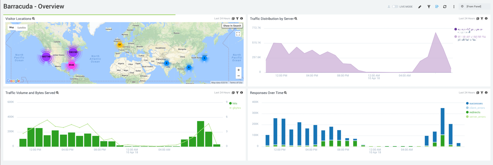
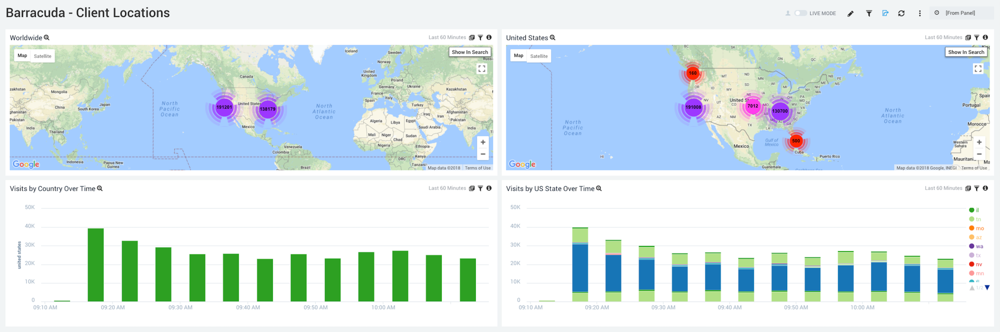
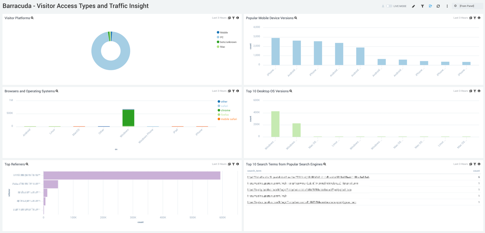
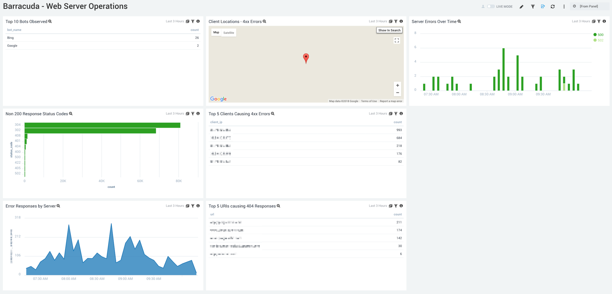

# Sumo Logic for Barracuda WAF
 Sumo Logic Community Content built for Barracuda WAF not yet published to the [App Catalog](https://help.sumologic.com/docs/integrations/).
 
 For instructions on how to collect logs and metrics for use with content, please see [Sumo Logic Documentation](https://help.sumologic.com/docs/send-data/). For more information, see Barracuda documentation at [Barracuda logging](https://campus.barracuda.com/product/webapplicationfirewall/doc/4259935/how-to-configure-syslog-and-other-logs/)

### To use the content:
- Download the JSON file(s).
- Find/replace all Source Categories within the JSON with your own Source Category (Ex: sourceCategory=yourSourceCategory).
- Import the content to your desired folder location in Sumo Logic.

### To upload your own content:
Please see [Sumo Logic Community Ecosystem Apps FAQs](https://help.sumologic.com/docs/integrations/community-ecosystem-apps/#faq).

Author: Jason Hwa