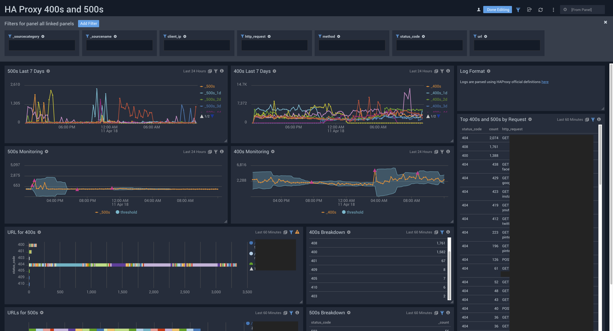

# Sumo Logic for HA Proxy
Sumo Logic Community Content built for HA Proxy that is not published to the [App Catalog](https://help.sumologic.com/docs/integrations/).

For instructions on how to collect logs and metrics for use with content, please see [Sumo Logic Documentation](https://help.sumologic.com/docs/send-data/). See [HA Proxy Documentation](https://www.haproxy.com/blog/haproxy-log-customization/) for standard HA Proxy the logging format and fields that this content was developed for.

### To use the content:
- Download the JSON file(s).
- Find/replace all Source Categories within the JSON with your own Source Category (Ex: sourceCategory=yourSourceCategory).
- [Import](https://help.sumologic.com/docs/get-started/library/#import-content) the content to your desired folder location in Sumo Logic.

### To upload your own content:
Please see [Sumo Logic Community Ecosystem Apps FAQs](https://help.sumologic.com/docs/integrations/community-ecosystem-apps/#faq).