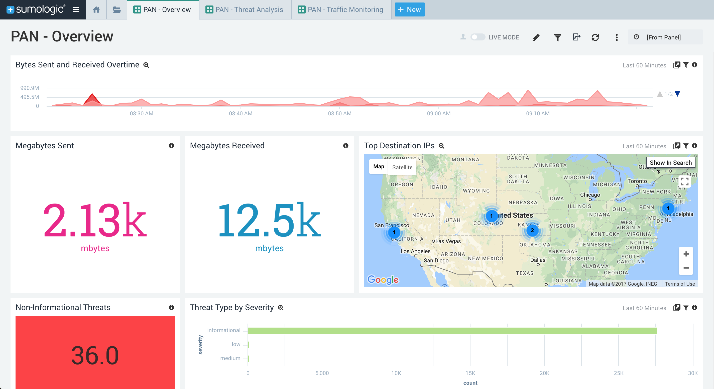
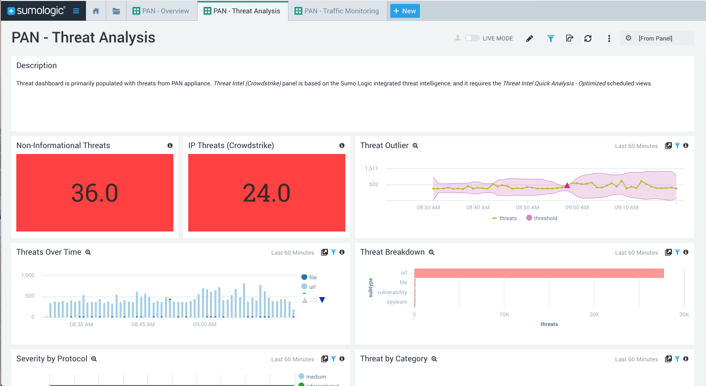
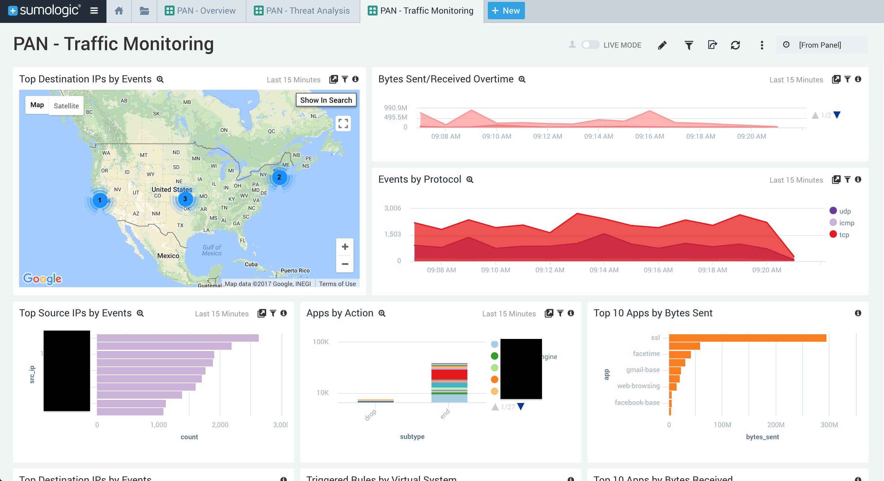

# Palo Alto Networks 7.x

This is an updated version of the Palo Alto Networks app to support parsing for PAN7.x.

Traffic parsing should work with the current parsing from PAN7; however, the updated app is primarly to work with PAN7 Threat logs. 

## Setup

### Setup Threat Intel Scheduled Views

The PAN7x app has a Threat dashboard for threats detected by the PAN appliance. Also included is a panel that integrates with Sumo Logic's integrated threat intelligence with Crowdstrike. 

This panel relies upon the Scheduled Views in the [Threat Intel Quick Analysis - Optimized](https://github.com/SumoLogic/sumologic-content/tree/master/Sumo-Logic-Tools/Threat_Intelligence_Optimized) app.

### Update Source Categories

Update source categories to the appropriate one(s):

PAN queries:
Update `$$PAN` to `_sourceCategory=yourSourceCategory`

Sumo Logic Threat Intelligence panel(s):

Update `$$PAN` to `_sourceCategory=yourSourceCategory`

### Import App

Once imported, the app should automatically be setup to query against PAN7 logs. 

## Additional Dashboards

