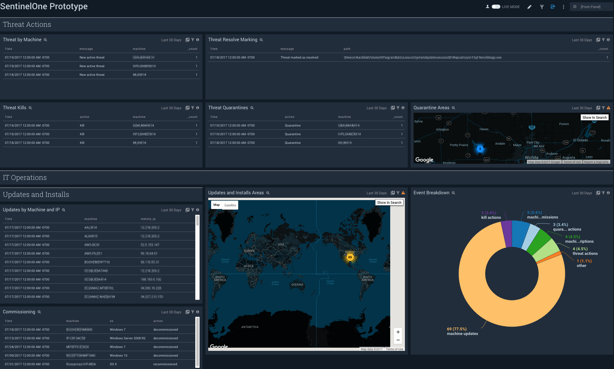

# Sumo Logic for SentinelOne
Sumo Logic Community Content built for SentinelOne that is not published to the [App Catalog](https://help.sumologic.com/docs/integrations/).

### To use the content:
- Download the JSON file(s).
- Find/replace all Source Categories within the JSON with your own Source Category (Ex: sourceCategory=yourSourceCategory).
- [Import](https://help.sumologic.com/docs/get-started/library/#import-content) the content to your desired folder location in Sumo Logic.

### Collection:
For instructions on how to collect logs and metrics for use with content, please see [Sumo Logic Documentation](https://help.sumologic.com/docs/send-data/). More information can be found at [Collect Logs for SentinelOne](https://help.sumologic.com/docs/send-data/collect-from-other-data-sources/collect-logs-sentinelone/).

### To upload your own content:
Please see [Sumo Logic Community Ecosystem Apps FAQs](https://help.sumologic.com/docs/integrations/community-ecosystem-apps/#faq).

### To add a review to content:
Please follow [How to add a review/rating to an app](https://help.sumologic.com/docs/integrations/community-ecosystem-apps/#how-do-i-add-a-reviewrating-to-an-app)