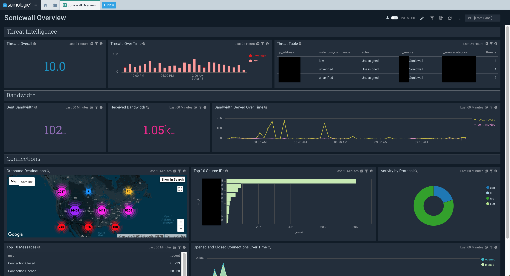

# SonicWall

This is a dashboard and parser for SonicWall appliances. 

The dashboard partially utilizes the parsers as well as the [Optimized Threat Intelligence scheduled view for IP addresses](https://github.com/SumoLogic/sumologic-content/blob/master/Sumo-Logic-Tools/Threat_Intelligence_Optimized/scheduled-views.txt).

## Setup

### Setup Threat Intel Scheduled Views for IP Addresses

The SonicWall dashboard has a threat section for threats detected by the Integrated Threat Intelligence on IP addresses. 

This panel relies upon the Scheduled Views in the [Threat Intel Quick Analysis - Optimized](https://github.com/SumoLogic/sumologic-content/tree/master/Sumo-Logic-Tools/Threat_Intelligence_Optimized) app.

### Update Source Categories

Update source categories to the appropriate one(s):

SonicWall queries:

Update `$$SonicWall` to `_sourceCategory=yourSourceCategory` 

Sumo Logic Threat Intelligence panel(s):
update `$$SonicWall` to `_sourceCategory=yourSourceCategory`

### Import App

Once imported, the app should automatically be setup to query against SonicWall logs.
