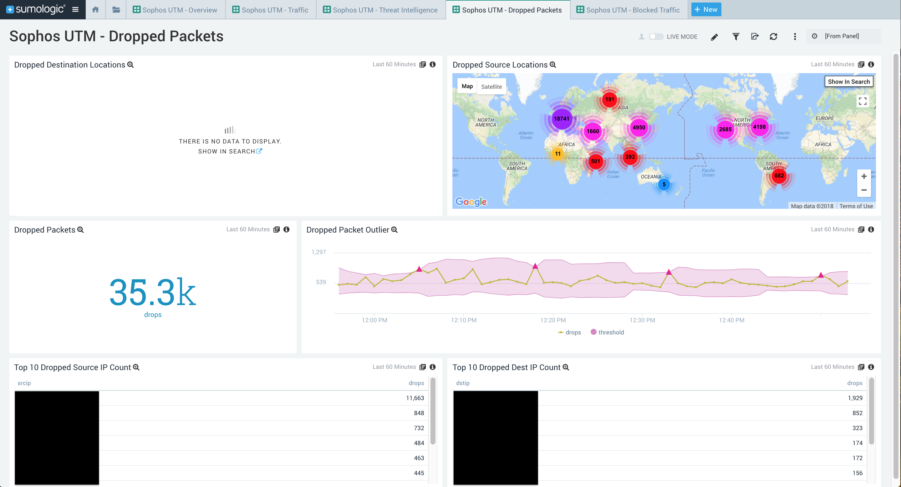

# Sumo Logic for Sophos UTM
Sumo Logic Community Content built for Sophos UTM that is not published to the [App Catalog](https://help.sumologic.com/docs/integrations/).

This is an app for Sophos UTM. It contains dashboards for an overview, blocked traffic, dropped packets, accepted traffic,  and threats per the Sumo Logic Integrated Threat Intelligence. 

### To use the content:
- Download the JSON file(s).
- Find/replace all Source Categories within the JSON with your own Source Category (Ex: sourceCategory=yourSourceCategory).
- [Import](https://help.sumologic.com/docs/get-started/library/#import-content) the content to your desired folder location in Sumo Logic. More information can be found at [Collect Logs for SentinelOne](https://help.sumologic.com/docs/send-data/collect-from-other-data-sources/collect-logs-sentinelone/).

### Collection:
For instructions on how to collect logs and metrics for use with content, please see [Sumo Logic Documentation](https://help.sumologic.com/docs/send-data/).

Sophos UTM logs are collected through syslog, and the Threat Intelligence relies on the [Threat Intelligence Quick Analysis Optimized](https://github.com/SumoLogic/sumologic-content/tree/master/Sumo-Logic-Tools/Threat_Intelligence_Optimized) scheduled views. 

Additional Steps:
- Setup Field Extraction Rules: The Sophos UTM app's queries heavily rely on Field Extraction Rules found in sophos-utm-field-extraction-rules.txt. Setup the FERs prior to installing the app. Optionally, you can modify the dashboards to use query-time parsing instead of FERs.
- Setup Threat Intel Scheduled Views: The Sophos UTM app has a threat dashboard for threats detected by Sumo Logic's integrated threat intelligence with Crowdstrike. This dashboard relies upon the Scheduled Views in the [Threat Intel Quick Analysis - Optimized](https://github.com/SumoLogic/sumologic-content/blob/master/Sumo-Logic-Tools/Threat_Intelligence_Optimized/scheduled-views.txt) app. Use the standard index names specified in the text document.

### To upload your own content:
Please see [Sumo Logic Community Ecosystem Apps FAQs](https://help.sumologic.com/docs/integrations/community-ecosystem-apps/#faq).

### To add a review to content:
Please follow [How to add a review/rating to an app](https://help.sumologic.com/docs/integrations/community-ecosystem-apps/#how-do-i-add-a-reviewrating-to-an-app)