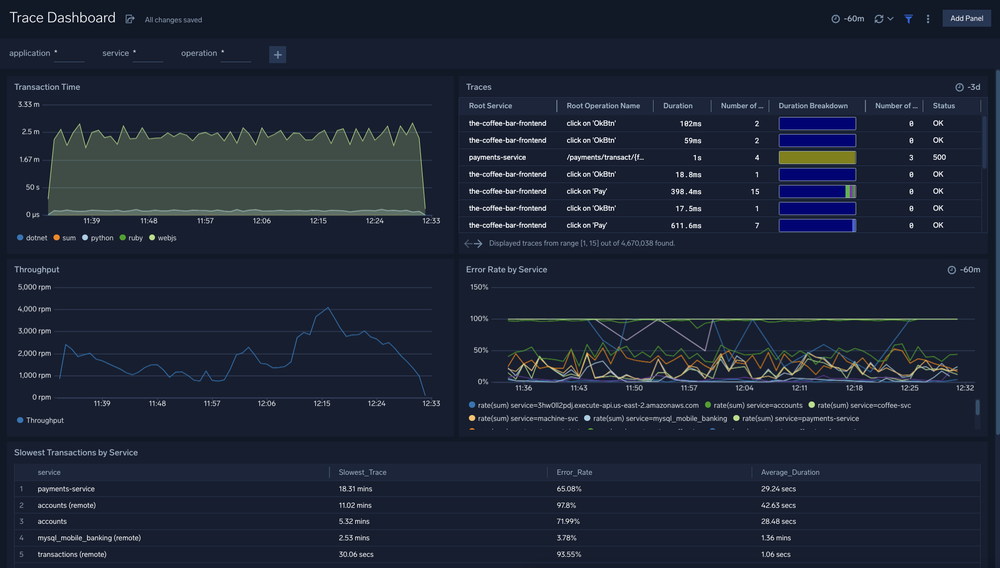

# Sumo Logic for Traces
Sumo Logic Community Content for Traces that is not published to the [App Catalog](https://help.sumologic.com/docs/integrations/).

This dashboard provides insights into traces, transaction times, throughput, error rates, and more.

### To use the content:
- Download the JSON file(s).
- [Import](https://help.sumologic.com/docs/get-started/library/#import-content) the content to your desired folder location in Sumo Logic.

### Collection:
For instructions on how to collect logs, metrics, or traces for use with content, please see [Sumo Logic Documentation](https://help.sumologic.com/docs/send-data/).

### To upload your own content:
Please see [Sumo Logic Community Ecosystem Apps FAQs](https://help.sumologic.com/docs/integrations/community-ecosystem-apps/#faq).

Creator: Patrick Rush (Sumo Logic SE)