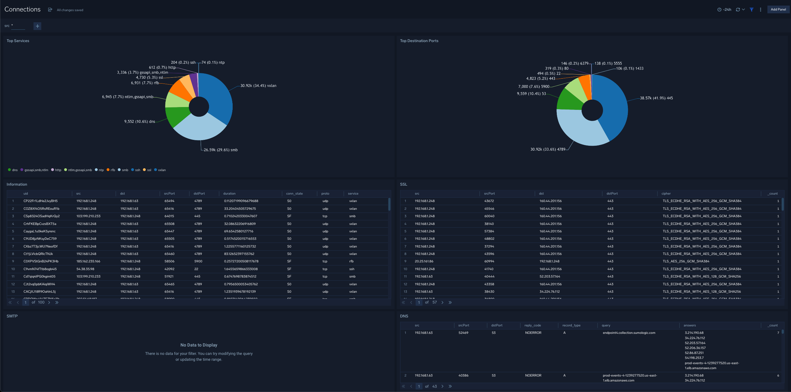
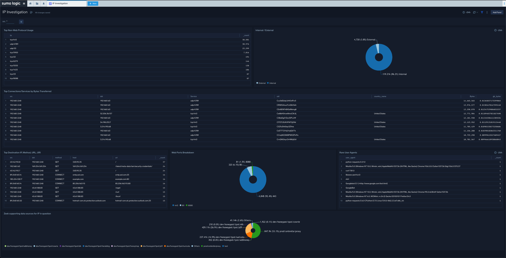

# Sumo Logic App for CSE Network Sensor
Sumo Logic Community Content for the CSE Network Sensor is not published to the [App Catalog](https://help.sumologic.com/docs/integrations/).

Background: The Network Sensor app aims to enable incident responders and threat hunters to work faster and more effectively resulting in powerful security insights through key traffic dashboards and [YARA detections](https://help.sumologic.com/docs/cse/rules/import-yara-rules/) such as:
- Connections: Creating situational awareness using lists of top services, ports, data flows, sources, and destinations.
- DNS: Detect potential DNS exfiltrations by spotting queries to non-existent domains and other high connection counts.
- Files: Potentially find executables hidden in benign extensions and compressed files. In addition, you can leverage an additional detection methodology here known as YARA. Please see [here](https://help.sumologic.com/docs/cse/rules/import-yara-rules/) for more information.
- HTTP: Find potentially suspicious HTTP transactions by reviewing a list of top host headers, sources, rare user agents and rare host headers.
- IP Investigation: Potentially identify anomalies by reviewing top protocol usage, internal vs. external connections, top connections by bytes transferred and where that IP address has been seen in other data sources in your environnement. 
- SMB: Detect potential SMB crawling/enumeration by understanding what systems/assets are still using SMB and what version of SMB. Gather real insights on where potential low hanging fruit may hide!
- SSL: Potentially find risky external/internal user connections to weaker SSL versions.

***Please note, there could be improvements to the app leveraging Sumo's outlier function and other functionality list. In addition, this app may work for normal corelight/zeek users as well. (Needs testing)***

### To use the content:
- Ensure that you have Sumo Logic's [Network Sensor](https://help.sumologic.com/docs/cse/sensors/network-sensor-deployment-guide/) deployed within your environment.
- Download the JSON file(s).
- Find/replace all Source Categories within the JSON with your own Source Category (Ex: sourceCategory=yourSourceCategory). *Please note, most of the time you will have to edit the json file to find and replace the default _sourceCategory with whatever matches your environment. Due to this being a Sumo Logic Network Sensor, the SCs are not different UNLESS changed by you. If you did change the default sourceCategories then please update accordingly*. 
- [Import](https://help.sumologic.com/docs/get-started/library/#import-content) the content to your desired folder location in Sumo Logic.

### Collection:
For instructions on how to collect logs and metrics for use with content, please see [Sumo Logic Documentation](https://help.sumologic.com/docs/send-data/). Ensure that you have Sumo Logic's [Network Sensor](https://help.sumologic.com/docs/cse/sensors/network-sensor-deployment-guide/) deployed within your environment.

### To upload your own content:
Please see [Sumo Logic Community Ecosystem Apps FAQs](https://help.sumologic.com/docs/integrations/community-ecosystem-apps/#faq).

### To add a review to content:
Please provide a comment for this content by following the guidelines below:

- Select the **Comments** folder.
- Open the **Comments.json** file.
- Select Edit (pen icon).
- Add a new line below the current comments, and paste in your ratings/comments using the following schema:

        {
            "reviewer":"[githubid/name]",
            "ratings":{
                "overall":4,
                "use-case":5,
                "design":4,
                "technical":4
            },
            "review":"This app is very useful for knowing x, y, and z. It would be great if the dashboards were broken out by use case instead of being one big dashboard."
        }

- Select **Propose New Changes**.
- Submit **Pull Request**.

Code owners will review and merge your rating of the content to the repo.

Please see [How to add a review/rating to an app](https://help.sumologic.com/docs/integrations/community-ecosystem-apps/#how-do-i-add-a-reviewrating-to-an-app) for more information.

Creator: Brandon Borodach (Sumo Logic SE)