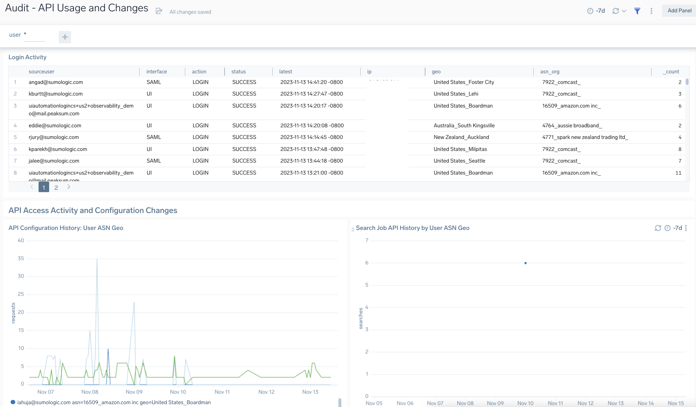
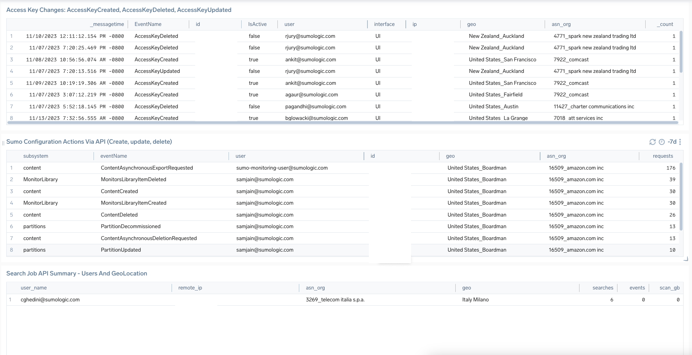
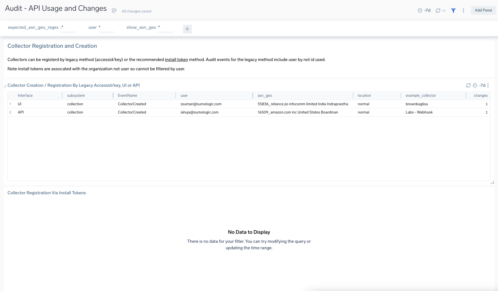

# Sumo Logic Audit Logging
Sumo Logic Community Content for Audit Logs.

This content summarizes logins via UI, API activity (configuration changes and Search Job API access), and collector registrations. The purpose of this content is to provide you with tools to investigate the scope of the [recent security incident (November 7, 2023)](https://www.sumologic.com/security-response-center/) in your environment.  We have asked the experts at Sumo Logic to compile a list of apps, queries, and custom dashboards to help aid you with your investigation.

Filters are available as below:
- user: filter on a user keyword pattern. Use * for any. Evaluated: sourceuser=*

### To use the content:
- Download the JSON file(s).
- [Import](https://help.sumologic.com/docs/get-started/library/#import-content) the content to your desired folder location in Sumo Logic.
- There are 3 core audit indexes available to you:
    - [Audit Index](https://help-opensource.sumologic.com/docs/manage/security/audit-indexes/audit-index/): Records logins to platform and many other activities. Best practice is to enable the Audit Index.
    - [Audit Event Index](https://help-opensource.sumologic.com/docs/manage/security/audit-indexes/audit-event-index/): For API configuration changes and changes to access keys. Provides event logs in JSON on activities from your account allowing you to monitor and audit changes. Enterprise accounts have this enabled and available to search by default.
    - [Search Audit Index](https://help-opensource.sumologic.com/docs/manage/security/audit-indexes/search-audit-index/): The Search Audit Index provides event logs on search usage and activities for your account. The index allows you to monitor and audit the search queries being run within your account, the types of queries, the users running them, and more. Best practice is to enable this index to allow auditing of search activity. If you have an Enterprise account, you have the ability to enable this index under Administration > Security > Policies.

If you haven’t already, consider installing the Enterprise Audit apps to further audit your Sumo Logic account. 

[Enterprise Audit Apps](https://help.sumologic.com/docs/integrations/sumo-apps/enterprise-audit/) utilize predefined searches and dashboards that provide visibility into your environment. The following Enterprise Audit Apps present information on account management activities, user activities, as well as management of library content (searches, dashboards/reports, and folders) for your Sumo Logic account:
- Enterprise Audit - Collector and Data Forwarding Management App presents information on Collector, Sources activities, and data forwarding trends by destination types.
- Enterprise Audit - Content Management App provides information on content activities, such as content that is created, updated, deleted, imported, exported, copied, moved, publicly accessed, made visible to the public, and application installed.
- Enterprise Audit - User & Role Management App provides visibility on user activities such as creating, deleting, and modifying user roles, email accounts, and password changes. You can also review various user session data.
- Enterprise Audit - Security Management App provides visibility into security posture, such as Access Key Activities, SAML Activities, Password Policy, Multi-Factor Authorization (MFA), and Service AllowList activities within your Sumo Logic Environment.

[Enterprise Search Audit App](https://help.sumologic.com/docs/integrations/sumo-apps/enterprise-search-audit/) provides immediate visibility into your account's search activity and helps you identify areas of improvement. It gives an overview of search usage within your org, with a breakdown by analytic tiers and other relevant search metrics such as data scanned bytes, etc. The pre-built dashboards also help you identify opportunities for improving search performance using the Search Audit Index.

Please note that audit data is not backfilled to any time before Enterprise Audit was installed. The Audit Event Index is enabled by default.

### To upload your own content:
Please see [Sumo Logic Community Ecosystem Apps FAQs](https://help.sumologic.com/docs/integrations/community-ecosystem-apps/#faq).

### To add review/comment to content:
Please provide a review/comment for this content by following the guidelines below:

- Select the **Comments** folder.
- Open the **Comments.json** file.
- Select Edit (pen icon).
- Add a new line below the current comments, and paste in your review/comment using the following schema:

        {
            "reviewer":"[githubid/name]",
            "ratings":{
                "overall":4,
                "use-case":5,
                "design":4,
                "technical":4
            },
            "review":"This app is very useful for knowing x, y, and z. It would be great if the dashboards were broken out by use case instead of being one big dashboard."
        }

- Select **Propose New Changes**.
- Submit **Pull Request**.

Code owners will review and merge your comments on the content to the repo.

Please see [How to add a review/comment to an app](https://help.sumologic.com/docs/integrations/community-ecosystem-apps/#how-do-i-add-a-reviewrating-to-an-app) for more information.